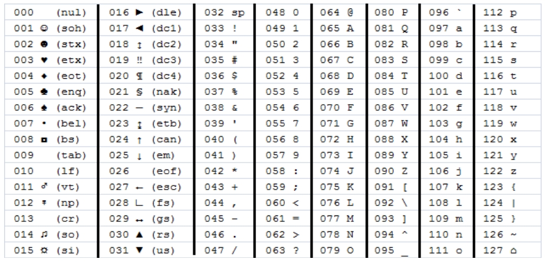
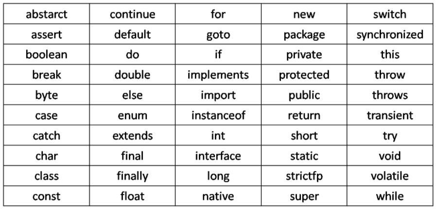
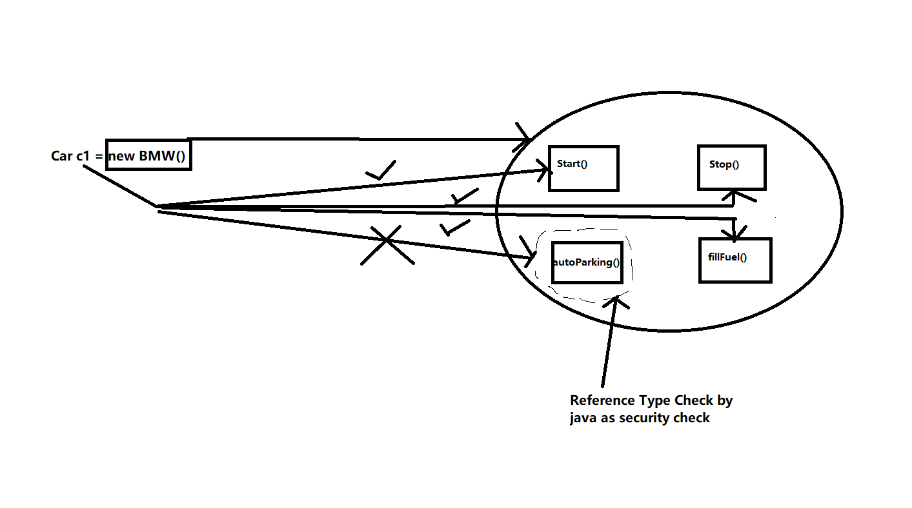
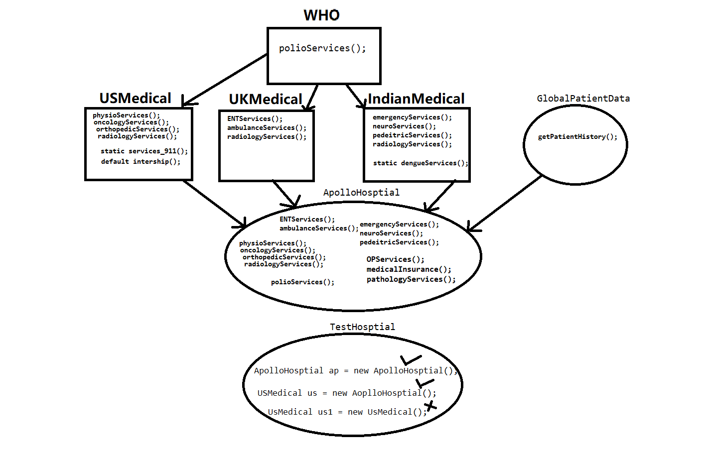
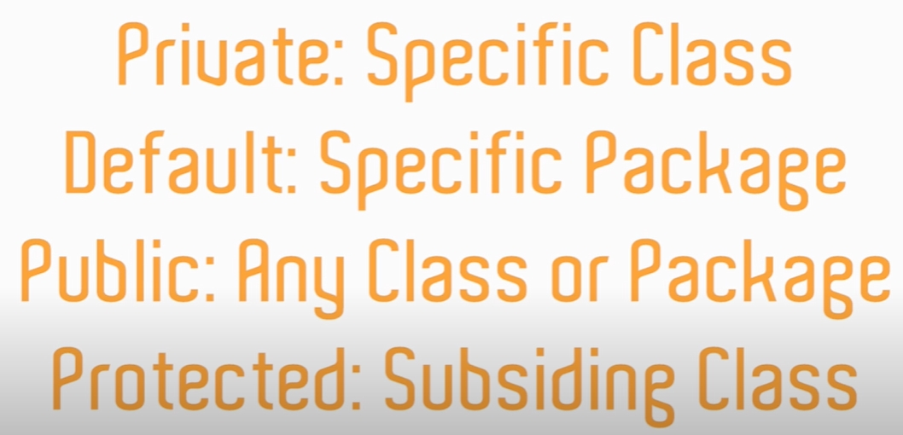
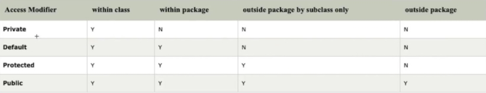

# Java Topics and Code
---

#### Details: 
* Created By: <b>Sarang Holey</b>
* Date: June-2020
* This Repo contain step by step Java Topics for training purposes. 
* You can download the project and import as Maven Project in Eclipse or IntelliJ in order to execute the programs.
* Reach out for more details about this repo: akashdktyagi@gmail.com/sarangholey@gmail.com

---
>Bringing the code in this File as well so as to have a consolidated view of all the Basic Java Programs.

## Code from the Project:

---
Session 1
---
#### Data Types in Java

>

```java
package _1_Session._1_DataTypesInJava;

/**
 * 
 * @author Sarang
 * Date - 01-10-2020
 *
 */

/*
 * 	Here in this class data types in java covered
 * 	Data types - 
 * 				1. Primitive Data types
 * 				These Data Types stored in memory without any object creation 
 * 				and the size of storing them is already defined in java.
 * 				Ex - byte, short, int, long, double, char, boolean
 * 
 * 				2. Non - Primitive Data types
 * 				They are stored in the form of objects in memory.
 * 				Ex - String, Array, List, Set
 */

public class _1_Different_Data_Types {
	
	public static void main(String[] args) {
		
		// Declaring a variable
		int height;
		
		// initialization of a variable
		height = 10;
		
		// Declaring & initialization a variable 
		int ageOfUser = 16; 	// with camel casing
		int age_of_user = 20; 	// by using underscore symbol
		
		
		// 1. Primitive Data types

		// ***********************************************************
		// ********************** Integer Family *********************
		// ***********************************************************
		// byte 1 byte | range -127 to 128 | 
		byte width = 10;
		byte temperature = -12;
		byte score = 00;
		byte weekDayNumber = 1;

		// short  2 byte | range -32768 to 32767 | 
		short s1 = 100;
		short s2 = -5678;
		short s3 = 00;

		// int 4 bytes | range -1247483648 to 2147483647 | 
		int i1 = 10;
		int i2 = 23;
		int i3 = 0;

		// long 8 byte | range very long no need to memorize |
		long l1 = 10;
		long l2 = -5645;
		long l3 = 00;

		// ***********************************************************
		// ******* floating point numbers (Decimal Numbers) **********
		// ***********************************************************
		// float 4 byte | range very long no need to memorize |
		float interestRate = 12.33f;  
		float f2 = (float)12.33; 
		float f3 = 75f;
		float f4 = 56; // 56.00
		float f5 = 0.00f;

		// double 8 bytes | range very long no need to memorize |
		double d1 = 12.33333333; 
		double d2 = 56;
		double d3 = 89.00;
		double d4 = 0;

		// ***********************************************************
		// ********************* boolean family **********************
		// ***********************************************************
		// boolean 1 bit [not perfectly defined in java docs] | range true / false | 
		boolean isIndianNationality = true; // 1
		boolean e2 = false; // 0

		// ***********************************************************
		// ********************* character family ********************
		// ***********************************************************
		//char 2 byte | it will accept Single character |
		char c1 = 'a';
		char c2 = '8';
		char c3 = '0';
		char c4 = '$';
		char c5 = '@';
		char c6 = '|';

		// 2. Non - Primitive Data types
		// ***********************************************************
		// ********************* String (it's a Class) ***************
		// ***********************************************************
		// String is a collection of characters (char) so size/range vary depending on usages.
		String javaVersion = "Currently Running on Java 1.8";
		String employeeId = "56451";
		String password = "2@45#";
		
		// ***********************************************************
		// ******** Printing the Values of different data types ******
		// ***********************************************************
		System.out.println("Primitive Data Types");
		System.out.println("Printing byte values ---->");
		System.out.println(width);
		System.out.println(temperature);
		System.out.println(score);
		System.out.println("--------------------------");
		
		System.out.println("Printing short values --->");
		System.out.println(s1);
		System.out.println(s2);
		System.out.println(s3);
		System.out.println("--------------------------");
		
		System.out.println("Printing integer values -->");
		System.out.println(i1);
		System.out.println(i2);
		System.out.println(i3);
		System.out.println("---------------------------");
		
		System.out.println("Printing long values ----->");
		System.out.println(l1);
		System.out.println(l2);
		System.out.println(l3);
		System.out.println("---------------------------");
		
		System.out.println("Printing float values ----->");
		System.out.println(interestRate);
		System.out.println(f2);
		System.out.println(f3);
		System.out.println(f4);
		System.out.println(f5);
		System.out.println("---------------------------");
		
		System.out.println("Printing double values --->");
		System.out.println(d1);
		System.out.println(d2);
		System.out.println(d3);
		System.out.println(d4);
		System.out.println("---------------------------");
		
		System.out.println("Printing boolean values -->");
		System.out.println(isIndianNationality);
		System.out.println(e2);
		System.out.println("---------------------------");
		
		System.out.println("Printing char values ----->");
		System.out.println(c1);
		System.out.println(c2);
		System.out.println(c3);
		System.out.println(c4);
		System.out.println(c5);
		System.out.println("---------------------------");
		
		System.out.println("Non - Primitive Data types ");
		System.out.println("Printing String values --->");
		System.out.println(javaVersion);
		System.out.println(employeeId);
		System.out.println(password);
		System.out.println("---------------------------");
		
	}

}

```
---
#### String and Character Concat

> 

```java
package _1_Session._2_StringAndCharacterConcatination;

/**
 * 
 * @author Sarang
 * Date - 01-10-2020
 *
 */

/*
 * 	Here in this class String concatenation in java covered
 * 	concatenation - merging or adding the values
 */

public class _2_String_And_Character_Concatination {

	public static void main(String[] args) {
		
		// *************************************************
		// 				1. String Concatenation
		// *************************************************
		
		String x = "Test";
		String y = "Seleium";
		
		String c = "100";
		String d = "200";
		
		int a = 100;
		int b = 200;

		System.out.println("\n---------------------------------\n");
		
		// 1. 
		System.out.println(a+b); // 300
		
		// 2. 
		System.out.println(x+y); // TestSeleium
		
		// 3.
		System.out.println(a+b+x); // 300Test
		
		// 4.
		System.out.println(a+b+x+y); // 300TestSeleium
		
		// 5.
		System.out.println(x+y+a);  // TestSeleium100
		
		// 6.
		System.out.println(x+y+a+b); // TestSeleium100 + 200 = TestSelenium100200
		
		System.out.println(c+d); // 100200
		
		// Use case
		int bill = 520;
		int tax = 30;
		//int total = bill+tax;
		//System.out.println("Food Bill is : " + total);
		System.out.println("Food Bill is : " + (bill+tax));
		
		
		// *************************************************
		// 			2. Character Concatenation
		// *************************************************
		char c1 = '5'; int z1 = 5;
		char c2 = '4'; int z2 = 4;
		char c3 = 'A'; String q1 = "A";
		char c4 = 'B'; String q2 = "B";
		
		System.out.println(c1+c2);
		System.out.println(z1+z2);
		System.out.println("-----------");
		System.out.println(c3+c4);
		System.out.println(q1+q2);
		
		

	}

}

```
#### Java key Word List:

> 

---

#### Increment and Decrement Operator

```java
package _1_Session._3_IncrementAndDecrementOperator;

public class _3_Incremental_And_Decremental {

	public static void main(String[] args) {
		
		// ++ and --
//		int a = 1;
//		a = a+1;
//		System.out.println(a);
		
		System.out.println("*********** pre increment **********");
		int i = 1;
		int j = ++i; //pre increment
		System.out.println(i); // 2
		System.out.println(j); // 2

		System.out.println("*********** post increment **********");
		int p = 1;
		int q = p++; //post increment
		System.out.println(p); // 2
		System.out.println(q); // 1

		System.out.println("*********** pre decrement **********");
		int m = 2;
		int n = --m; //pre decrement
		System.out.println(m); // 1 
		System.out.println(n); // 1 

		System.out.println("*********** post decrement **********");
		int c = 0;
		int d = c--;
		System.out.println(c); // -1
		System.out.println(d); // 0

		int f = -1;
		int g = --f;
		System.out.println(f); // -2  
		System.out.println(g); // -2  

	}

}

```
---
Session 2
---
#### Conditional Operator

```java
package _2_Session._1_Conditional_Operators;

public class _1_Conditional_Operators {
	
	public static void main(String[] args) {
		
		// Conditional operators are used to check & compare the
		// condition between the variables & values
		// Ex 	1. == :- Comparison operator 	
		//		2. > :- Greater than operator
		//		3. < :- Less than operator
		//		4. >= :- Greater than equal to operator
		//		5. <= :- Less than equal to operator
		//		6. != :- Not equal to operator
		//		7. && :- AND / Short Circuit operator
		//		8. || :- OR operator
		
		int a = 10;
		int b = 20;
		
//		// Example - 1
//		// Compare (Validate) which one is greater between two values
//		if(b > a)
//		{
//			System.out.println("b is greater than a");
//		}
//		else // optional part not necessary to write every time 
//		{
//			System.out.println("a is greater than b");
//		}
//		
//		System.out.println("----------------------------------------");
		
		// Example - 2
		// Compare (Validate) which one is greater between two values
		// Or are the two values are same
		if(b == a)
		{
			System.out.println("both values are equal");
		}
		else if(b > a)
		{
			System.out.println("b is greater than a");
		}
		else // optional part not necessary to write everytime 
		{
			System.out.println("a is greater than b");
		}
		
		System.out.println("----------------------------------------");
		
		// Example - 3
		// Compare (Validate) which one is greater between two values
		// Or are the two values are same
		if(b >= a)
		{
			System.out.println("b is greater than a or equal to a");
		}
		else
		{
			System.out.println("b is less than a or equal to a");
		}

		System.out.println("----------------------------------------");
		
		// Example - 4
		// Not equal to operator
		
		int total = 100;
		if(!(total == 0)) // total == 0 is false and !false equals to true
		{
			System.out.println("this is bill is eligible for 10% discount");
		}
		else {
			System.out.println("this is bill is not eligible for discount");
		}
		
		// Example - 5
		// Dead code - A part of code which will not executed any time
		// even though its syntactically correct
		
		// if statement needs always a true condition to execute the code
		// try for not equal to operator
		if(false)  
		{
			System.out.println("Hello there, How are you");
		}
		else
		{
			System.out.println("Good bye");
		}

		System.out.println("----------------------------------------");
		
		// Example - 6
		// Nested if
		int num = 15;
		if(num > 10)
		{
			if(num == 15)
			{
				System.out.println("Number is equal to 15");
			}
			if(num == 17)
			{
				System.out.println("Number is equal to 17");
			}
		}
		else {
			System.out.println("number is less than or equal to 10");
		}
	
		System.out.println("----------------------------------------");
		
		// Example - 7
		// Nested if - else if 
		int number = 10; //10 40 50
		if(number == 10)
		{
			System.out.println("The number is 10");
		}
		else if (number == 20) 
		{
			System.out.println("The number is 20");
		}
		else if (number == 30) 
		{
			System.out.println("The number is 30");
		}
		else {
			System.out.println("number is not found...");
		}

		System.out.println("----------------------------------------");
		
		// Example - 8
		// && operator	- true && true = true
		// 				- false && true = false
		// 				- true && false = false
		// 				- false && false = false		
		// WAP to find highest number form 3 numbers
		int x = 100;
		int y = 200;
		int z = 300;
		
		if(x>y && x>z) 
		{
			System.out.println("x is the higest number");
		}
		else if (y>z)
		{
			System.out.println("y is the higest number");
		}
		else 
		{
			System.out.println("z is the higest number");
		}

		System.out.println("----------------------------------------");
		// Example - 8
		// || operator	- true && true = true
		// 				- false || true = true
		// 				- true || false = true
		// 				- false || false = false	
		String UserName = "Manish";
		if (UserName == "Tom" || UserName == "Peter") {
			System.out.println("Hi developer " + UserName);
			System.out.println("How may I help you?");
		} 
		else if (UserName == "Steve" || UserName == "Joe")
		{
			System.out.println("Hi tester " + UserName);
			System.out.println("How may I help you?");
		}
		else {
			System.out.println("Hi there " + UserName);
			System.out.println("How may I help you?");
		}
		
		
	}

}

```
---

#### Switch Case Statement

```java
package _2_Session._2_SwitchCase_Concept;

public class _1_SwitchCase_Statement {

	public static void main(String[] args) {
		
		// Switch Case is used to check multiple conditions
		// In switch case String & integer are used to switch between
		// different cases
		// Performance wise switch case is good than if else
		
		// Example - 1
		int number = 2;
		
		switch (number) {
		case 0 :
			System.out.println("Number is zero");
			break;
		case 1:
			System.out.println("Number is one");
			break;
		case 2:
			System.out.println("Number is two");
			break;
		case 3:
			System.out.println("Number is three");
			break;
		case 4:
			System.out.println("Number is four");
			break;
		case 5:
			System.out.println("Number is five");
			break;
		case 6:
			System.out.println("Number is six");
			break;
		case 7:
			System.out.println("Number is seven");
			break;
		case 8:
			System.out.println("Number is eight");
			break;
		case 9:
			System.out.println("Number is nine");
			break;
		default:
			System.out.println("Enter a number between Zero to Nine ");
			break;
		}
		
		System.out.println("------------------------------------");
		
		// Example - 2
		// Switch case without break statement
		int p = 2;
		switch (p) {
		case 1:
		case 2:
			System.out.println("Hello");
			
		case 3:
		case 4:
			System.out.println("Hi");
			break;
		default:
			break;
		}
		 
		// use case - browser switching
		// Example - 3
		String browser = "chrome";
		
		switch (browser) {
		case "chrome":
			System.out.println("Chrome browser invoked");
			break;
		case "firefox":
			System.out.println("Firefox browser invoked");
			break;

		default:
			System.out.println("safari browser is not implemented");
			break;
		}
		

	}

}

```
---
Session 3
---
#### While Loop

```java
package _3_Session._1_While_Loop;

public class _1_While_loop {
	
	public static void main(String[] args) {
		
		// To iterate some value or execute some line of code
		// in a loop with some condition
		
		// To print 1 to 5 integer
		// Worst way of of printing by coding
		System.out.println(1);
		System.out.println(2);
		System.out.println(3);
		System.out.println(4);
		System.out.println(5);

		System.out.println("-----------------------------");
		
		// To print 1 to 10 integer
		// While loop
		int i = 1; // Start Point
		while(i<=10) // condition
		{
			// Iteration
			System.out.println(i); // 1 2 3 ..... 10
			// Condition to increase the counter value
			// otherwise the loop 
			i++; // (++i) or (i=i+1) also fine here
		}

		System.out.println("-----------------------------");
		
		// Example - Print the statement when loop 
		// reaches to number 5
		int j = 1;
		while(j<=10) // condition
		{
			// Iteration
			System.out.println(j); // 1 2 3 4
			
			if(j == 5)
			{
				System.out.println("Hey this is Five here");
				// if after number 5 if no need to print next numbers use break
				//break;
			}
			// Condition to increase the counter value
			j++; // (++j) or (j=j+1) also fine here
		}

		System.out.println("-----------------------------");
		
		// Example - After received cash from customer on billing counter
		// by using boolean condition in while loop
		boolean isCashReceived = true;
		int amount = 250;
		while(isCashReceived)
		{
			System.out.println("Your bill is paid successfully !!! with amount -> " + amount);
			System.out.println("Thank you!");
			
			// condition to break the loop
			// if below condition missed then system goes in infinite loop
			isCashReceived = false;
			
		}
		
	}
	

}

```

---
#### For Loop
```java
package _3_Session._2_For_Loop;

public class _1_for_loop {
	
	public static void main(String[] args) {
		
		
		// To print 1 to 10 integer
		// For loop
		System.out.println("Values in from range 1 to 10 are ->");
		for (int i = 1; i <= 10; i++) {
			System.out.println(i);
		}
		
		System.out.println("-----------------------------");
		
		// Example - Print only even numbers in between 1 to 20
		System.out.println("Even numbers from 0 to 20 are ->");
		for (int even = 0; even <= 20; even = even+2) {
			System.out.println(even); // 0, 2,... 18, 20 
		}

		System.out.println("-----------------------------");
		
		// Example - Print only even numbers in between 1 to 20
		// with an if condition
		System.out.println("Even numbers from 0 to 20 using if condition are ->");
		for (int j = 0; j <= 20; j++) { //0 1 2 3 4 .... 20
			if (j % 2 == 0) {
				System.out.println(j);
			}
			
		}
		
		// use case - While working with an application
		// To print all links on a page for loop is used
	}

}

```
---

#### For Loop Pattern Printing

```java
package _3_Session._2_For_Loop;

public class _2_for_loop_pattern_printing {
	
	public static void main(String[] args) {
	
		// Print the following pattern
		//		*
		//		**
		//		***
		//		****
		
		for(int i=1;i<=4;i++) // for printing columns
		{
			for(int j=1;j<=i;j++) // for printing rows
			{
				System.out.print("*");
			}
			System.out.println();
		}
		
		System.out.println("--------------------");
		System.out.println();
		
		// Print the following pattern
		//		****
		//		***
		//		**
		//		*
		
		for(int i=1;i<=4;i++) // for printing columns
		{
			for(int j=4;j>=i;j--) // for printing rows
			{
				System.out.print("*");
			}
			System.out.println();
		}
		
		
	}

}

```

---
#### Do While Loop

```java
package _3_Session._3_Do_While_Loop;

public class _1_do_while_loop {

	public static void main(String[] args) {
		
		// Do while loop is similar to while loop
		// only with one difference as
		// At least one time the do block get executed
		System.out.println("Values from range 10 to 20 are ->");
		int i = 10; // Start Point
		do {
			System.out.println(i);
			i++;
		} 
		while (i<=20); // condition
	}

}

```
---
Session 4
---
#### Array In Java

```java
package _4_Session._1_Array;

public class _1_Array_In_Java {

	public static void main(String[] args) {
		
		// Array are used to store the same kind of variable with a single name. 
		// Also to save similar data we don't have to maintain unnecessary different variables 
		// with different names.
		
		// Example
		int i = 10; 
		i = 20;
		int j = 30;
		//int k = 40;
		System.out.println("Value of i is " + i);
		System.out.println(i);
		// the value of i is getting overridden 
		// here is a problem if I want to store 10 and 20 and don't want to maintain a new variable.

		System.out.println("----------------------------------------------------");
		
		// Ways of declaration for Array
		//  Example - 1
		int[] q = new int[4];
		
		int x[] = new int[3]; 
		// or 
		int []y = new int[3]; 
		// or 
		int z[] = {10,20,30};
		
		// Here Index number starting from 0 to 2 and length of array is 3 i.e for 0 to 2
		// Note - The "new" keyword is to create data space into an array and not like to create objects with new keyword.
		
		x[0] = 10; // filling 10 int value at 0th index
		x[1] = 20; // filling 20 int value at 1st index
		x[2] = 50; // filling 50 int value at 2nd index
		//x[3] = 99;
		// Access the values from the array
		System.out.println(x[2]); // O/P - 50 // accessing data from 2nd index form the array
		//System.out.println(x[5]); // O/P - java.lang.ArrayIndexOutOfBoundsException as there is no such index for i array
		System.out.println(x.length); // O/P  - 3 the .length is a method used to calculate the length of an array.
		System.out.println(x[1]+x[2]); // O/P - 70
		
		// To print all/specific the values from array
		for(int k=0; k<x.length; k++) // if we write k<=i.length then after printing 10 20 50 it will throw exception
		// for(int k=0; k<=i.length()-1; k++) // can be used also
		{
			System.out.println(x[k]);
			if(x[k]==20)
			{
				System.out.println("The value 20 found in the array at index no -> " + k);
			}	
		}

		System.out.println("----------------------------------------------------");
		
		// Example - 2 
		double k1[] = new double[5];
		k1[0] = 12.33;
		k1[1] = 45.56;
		// k1[2] = 45.56;
		k1[3] = 50; // can be stored as double can store int // 50.00
		k1[4]  = 99.78;
		//k1[7] = 66.45; // at this line compiler won�t show any error but it will throw a runtime exception when code is 
		//executed either we print the value or not in both conditions
		
		System.out.println(k1[0]);
		System.out.println(k1[2]); // O/P - 0.00 as we haven�t stored any value at 2nd index so default value is printed.
		// System.out.println(k1[7]); // this will throw java.lang.ArrayIndexOutOfBoundsException

		System.out.println("----------------------------------------------------");
		
		// Example - 3
		String browsers[] = new String[4];
		browsers[0] = "chrome";
		browsers[1] = "opera";
		browsers[2] = "firefox";
		//browsers[3] = "ie";
		browsers[3] = "safari";
		
		for(int row=0; row<browsers.length; row++)
		{
			System.out.println(browsers[row]);
			
			if(browsers[row].equals("chrome"))
			{
					System.out.println("Launch chrome�...");
			}
			else if(browsers[row].equals("opera"))
			{
					System.out.println("Launch opera....");
			}
			else if(browsers[row].equals("firefox"))
			{
					System.out.println("Launch firefox....");
			}
			else if(browsers[row].equals("ie"))
			{
					System.out.println("Launch ie.....");
			}
			else
			{
					System.out.println("No browser matches, enter the correct value");
			}
		}


		System.out.println("----------------------------------------------------");
		
		// Summary of topic 
		// Exceptions in array comes? -> - ArrayIndexOutOfBoundException
		// .length used to check the length of the array 
		// Array will store data in form of indexes
		// Array can be declared in many types
		// While comparing primitive data types in array use == operator and for not primitive data types comparison use .equals method

		// Limitation of Arrays
		// 1. Suppose we have to store some kind of data like student name information,
		// employee name and we have to use an array then we have to either declare the array 
		// size more then extra memory allocation happens and vice versa.
		// 2. Size of array is fixed once it's created so we use arraylist to overcome this problem
		// 3. Similar kind of data has to be stored in Array - We can use Object Array or ArrayList, 
		// but still in object array the size is fixed.(Object is super class of all classes)
		// 4. Object array or normal array is used in real time applications where the data size is fixed 
		// ex- days in week, months, dates in month. Object Array ex - Employee information with Name, DOB, EmpId, EmpDept
		// 5. Garbage collector dont remove the excess space which is unused by the huge array sizes, 
		// Gc will only removes objects which are unused

		System.out.println("----------------------------------------------------");
		Object emp[] = new Object[5];
		emp[0] = "Tom"; // name
		emp[1] = 25; // age
		emp[2] = 499; // salary in dollars
		emp[3] = true; // resident of india
		emp[4] = 'm'; // gender
		for(int a=0; a<emp.length; a++)
		{
		System.out.println(emp[a]);
		}
		
		// In the above example 
		// it will print all information about the employee. 
		// What if the parameters like having a laptop, contract type, etc then again we have to increase the size of the array. 

		// So we can use these array and Object array where the parameters and size of data is permanent type or fixed type. 
		// Ex - days in a week, months, 
		// Number of branches of a company, 
		// departments of the companies, 
		// number of subjects in a semester, 
		// flat numbers in an apartment.

		//Note - 
		// 1. if we don�t add the values in the array and try to print it then the default value of the data type will get printed.
		// 2. New keyword in arrays is used to allocate memory not for creation of object (in array context).
		
		


	}

}

```

---
#### String Manipulation

```java
package _4_Session._2_String_Manipulation;

public class _2_String_Methods {

	public static void main(String[] args) {
		
		//Notes - 
		// String is a class & is a non primitive data type in java
		// Non primitive data types having some functions associated with it
		// String stores values in terms of a collection of Characters with index values

		System.out.println("\n---------------------------------\n");

		// 1. Finding a length of an String
		String str1 = "Hello Everyone Lets learn somthing about String"; 
		System.out.println("The length of str1 string is : " + str1.length());
		// Note - 	1. length() - to calculate the length of String
		//			2. length - is a keyword to calculate length of array

		System.out.println("\n---------------------------------\n");

		// 2. Find character at some specific index value 
		String str2 = "I am learning String in Java";
		System.out.println("Character in string str2 at Second index value is : " + str2.charAt(2));
		System.out.println(str2.length());
		//System.out.println("Character in string str2 at 48th index is : " + str2.charAt(48));

		System.out.println("\n---------------------------------\n");

		// 3. Find index number of a specific character in string
		String str3 = "Hello there";
		System.out.println(str3.length());
		System.out.println("Index number of character 'e' in String str3 is : " + str3.indexOf('e'));
		System.out.println("Index number of character 'e' second occurence in String str3 is : " + str3.indexOf('e', 2));
		System.out.println("Index number of character 'e' second occurence in String str3 is : " + str3.indexOf('e', str3.indexOf('e')+1)); // alternate way
		System.out.println("Index number of character 'z' in string str3 is : " + str3.indexOf('z'));

		System.out.println("\n---------------------------------\n");

		// 4. Find start index of a specific word in a string
		String str4 = "GitHub is aquired by microsoft in year 2018";
		System.out.println("Index number for the word \"by\" in string str4 is : " + str4.indexOf("by"));
		System.out.println("Index number for the word \"apple\" in string str4 is : " + str4.indexOf("apple"));

		System.out.println("\n---------------------------------\n");

		// 5. To convert all characters in a string into upper case
		String str5 = "Selenium is used to automate web application";
		System.out.println("Converting string str5 to uppercase : " + str5.toUpperCase());


		System.out.println("\n---------------------------------\n");

		// 6. To convert all characters in a string into upper case
		String str6 = "SELENIUM CANNOt AUTOMATe DEXTOP APPLICATIONS";
		System.out.println("Converting string str6 to uppercase : " + str6.toLowerCase());

		System.out.println("\n---------------------------------\n");

		// 7. To remove empty spaces present before and after from the string
		String str7 = "            Selenium is free automation tool   ";
		System.out.println("After removing extra spaces from before & after of String str7 output is :- " + str7.trim());

		System.out.println("\n---------------------------------\n");

		// 8. To remove some repeating specific character from the string
		String str8 = "15/11/2012"; // 15:11:2012
		System.out.println("After replacing the '/' to ':' str8 becomes " + str8.replace('/', ':'));

		System.out.println("\n---------------------------------\n");

		// 9. To check a specific word available in a string [with Case sensitivity]
		String str9 = "Selenium can handle the html code";
		System.out.println("The availibilty of word \"Selenium\" is : " + str9.contains("Selenium"));

		System.out.println("\n---------------------------------\n");

		// 10. To fetch a part from a string
		String str10 = "The transation number is - 45AdSJ9t";
		System.out.println("The transation number is : " + str10.substring(27));

		System.out.println("\n---------------------------------\n");

		// 11. To fetch a word from a string
		String str11 = "Your transaction number is - 78E354dL thank you";
		String TransationId = str11.substring(29, 37);
		System.out.println("The extracted id from str11 is : " + TransationId);

		System.out.println("\n---------------------------------\n");

		// 12. To compare two strings
		String statement1 = "Java is platform independent";
		String statement2 = "java is platform independent";
		String statement3 = "Java is platform independent";
		System.out.println("Are statement1 & statement2 having exact same content : " + statement1.equals(statement2));
		System.out.println("Are statement1 & statement3 having exact same content : " + statement1.equals(statement3));
		System.out.println("Are statement1 & statement2 having exact same content : " + statement1.equalsIgnoreCase(statement2));

		System.out.println("\n---------------------------------\n");

		// 13. Splitting the String on basis of some specific char
		String str13 = "Java is based on Object Oeriented Programming Principles";
		String[] words = str13.split(" "); 
		for (int i = 0; i < words.length; i++) {
			System.out.println(words[i]);
		}

		System.out.println("\n---------------------------------\n");

		// 14. Splitting the String on basis of some specific char & print it in reverse order(Word by word)
		String stm = "Good Bye";
		String revWord[] = stm.split(" ");
		System.out.println(revWord[1]+" "+revWord[0]); // O/P - "Bye Good"

	}

}

```
---
Session 5
---

#### Object Array

```java
package _5_Session._1_Object_Array;

public class _1_Object_Array {

	public static void main(String[] args) {


		// object static array:
		Object emp[] = new Object[5];
		emp[0] = "Tom"; 	// Name
		emp[1] = 25;		// Age
		emp[2] = 10000;		// Salary 
		emp[3] = 'm';		// gender
		emp[4] = true;		// Resident of India

		System.out.println("Employee Imformation as below - ");
		for (int m = 0; m < emp.length; m++) {
			System.out.print(m+1 + ". ");
			System.out.println(emp[m]);
		}
		System.out.println(emp[4]);

	}


}


```

---

#### Dynamic Array-Array List Raw Type
```java
package _5_Session._2_Dynamic_Array;

import java.util.ArrayList;

public class _1_ArrayList_RawType {

	public static void main(String[] args) {
		
		ArrayList ar = new ArrayList(); // raw type arraylist, here any type of data can be stored
		
		System.out.println("---------------------------");
		System.out.println("Empty Arraylist Size is -> ");
		System.out.println(ar.size()); // will print size of ArrayList which is 0
		System.out.println("---------------------------");
		
		System.out.println("Adding values 3 values in the empty arraylist");
		ar.add(100); // 0th index
		ar.add(200); // 1st index
		ar.add("test"); // 2nd index
		System.out.println("After adding 3 values checking the size of arraylist -> ");
		System.out.println(ar.size()); // will print size of ArrayList which is 3
		System.out.println("---------------------------");
		
		System.out.println("Adding 2 more values in arraylist");
		ar.add(500); // 3rd index
		ar.add(800); // 4th index
		System.out.println("After adding 2 more values checking the size of arraylist -> ");
		System.out.println(ar.size()); // will print size of ArrayList which is 5
		System.out.println("---------------------------");
		
		System.out.println("Printing all values from the arraylist");
		// To print all values of the ArrayList
		for(int i=0; i<ar.size(); i++)
		{
			System.out.println(ar.get(i)); // this will print all the values currently an ArrayList is holding
		}
		System.out.println("---------------------------");
		
		System.out.println("Accessing value form arraylist with specific index");
		System.out.println(ar.get(2)); // will print the value of 2nd index value which is test
		System.out.println("---------------------------");
		
		System.out.println("Trying to access a value form arraylist more than its decleared size");
		// System.out.println(ar.get(6)); // will throw exception  java.lang.IndexOutOfBoundException as there is no value at  6th index
		System.out.println("---------------------------");
		
		System.out.println("Removing value form arraylist at a specific index and re-printing the values");
		ar.remove(3); // this will remove the value from 3rd index
		System.out.println("After removing the value from 3rd index the size of arraylist is -> " + ar.size());
		for(int j=0; j<ar.size(); j++)
		{
			System.out.println(ar.get(j)); // this will print all the values currently an ArrayList is holding
		}
		System.out.println("---------------------------");
		
		System.out.println("Checking a value is available in the arraylist");
		// To check some values is present in ArrayList
		for(int k=0; k<ar.size(); k++)
		{
			if (ar.get(k).equals("test")) 
			{
				System.out.println("At index value " + k + " \"" + ar.get(k) + "\" is present");
			}
		}
	
	}

}

```
---

#### Dynamic Array-ArrayList Generic Type
```java
package _5_Session._2_Dynamic_Array;

import java.util.ArrayList;

public class _2_ArrayList_GenricType {

	public static void main(String[] args) {
		
		// Arraylist of String Type
		ArrayList<String> userNames = new ArrayList<String>();
		userNames.add("Tom");
		userNames.add("Peter");
		userNames.add("Mark");
		// userNames.add(45); // this line will throw an error at compile time
		
		System.out.println("Printing the all values form arraylist");
		for (int i = 0; i < userNames.size(); i++) {
			System.out.println(userNames.get(i));
		}
		
		ArrayList<Integer> numberList = new ArrayList<Integer>();
		numberList.add(10);
		numberList.add(20);
		numberList.add(30);
		numberList.add(40);
		// numberList.add("Fifty"); // this line will throw an error at compile time
		
		System.out.println("Printing the all values form arraylist");
		for (int i = 0; i < numberList.size(); i++) {
			System.out.println(numberList.get(i));
		}


	}

}

```

#### Dynamic Array Array List Object Type
---
```java
package _5_Session._2_Dynamic_Array;

import java.util.ArrayList;

public class _3_ArrayList_ObjectType {

	public static void main(String[] args) {
		
		ArrayList<Object> employeeInf = new ArrayList<Object>();
		employeeInf.add("Tom");
		employeeInf.add('m');
		employeeInf.add(499);
		employeeInf.add(true);
		
		System.out.println("----------------------");
		System.out.println("After adding elements in the arraylist of Object type size is -> " + employeeInf.size());
		
		
		// Printing all values of arraylist
		System.out.println("Printing the all values form arraylist");
		for (int i = 0; i < employeeInf.size(); i++) {
			System.out.println(employeeInf.get(i));
		}	
		
		System.out.println("----------------------");
		// Removing all elements from the arraylist in one go
		employeeInf.clear();
		System.out.println("After using .clear() method on arraylist of Object type size is -> " + employeeInf.size());

	}
}

```
---

#### Data Conversion-Wrapper Class
```java
package _5_Session._3_Data_Conversion;

public class _1_Wrapper_Classes {

	public static void main(String[] args) 
	{

		// To convert data from one data type to another
		
		// 1. String to Integer
		System.out.println("String to Integer");
		String x = "100";
		System.out.println(x+10); // 10010
		int i = Integer.parseInt(x); // converting string to int
		System.out.println(i+10); // 110
		System.out.println("------------------");
		
		// 2. Integer to String
		System.out.println("Integer to String");
		int q = 10;
		System.out.println(q+5); // 15
		String s = String.valueOf(q);
		System.out.println(s+5); // 1015
		System.out.println("------------------");
		
		// 3. String to Double
		System.out.println("String to Double");
		String b = "12.33";
		double d = Double.parseDouble(b); // Converting String to double
		System.out.println(d+10.00);
		System.out.println("------------------");
		
		// Exmaple - 
		String g = "$156";
		int h = Integer.parseInt(g); // it will throw NumberFormatException
		System.out.println(h);
	}

}

```
---
Session 6
---
#### Default Values

> 

```java
package _6_Session._1_Default_Values;

public class _1_DefaultValues
{ 	
	public static String str;
	public static int i;
	public static double d;
	public static boolean b;
	public static char c;
	public static byte z;

	public static void main(String[] args)
	{	
		System.out.println(str); 
		System.out.println(i); 
		System.out.println(d); 
		System.out.println(b); 
		System.out.println(c); 
		System.out.println(z); 
		
		System.out.println("--------------------------------------");
		
		//int p; // only variable declared without initialing value
		//System.out.println(p); // this will show an error as the variable p is local to main method and
		
		//value for it has to be declared.
		int div1 = 9/3;
		System.out.println(div1);
		int div2 = 0/3;
		System.out.println(div2);
		//int div3 = 9/0; 
		//System.out.println(div3);
				
	}
}

```
---
#### Classes And Methods

```java
package _6_Session._2_Classes_And_Methods;

public class _1_WebPage {

	//	1. All the code we write in java is inside class. 
	//	Class is a template where we write our logic, similar to the kind of 
	//	things/logic we will write in the same class. 
	
	//	2. An object is an entity that comes from class.
	//	And when we create an object of this class we will have all the data members with each object.

	
	String title = "Welcome to BestGoods";
	String url = "https://www.bestgoods.com";
	String header = "bestgoods.com: Online Shopping - Buy mobiles, laptops, cameras, books, "
					+ "watches, apparel, shoes and e-Gift Cards. Free Shipping & Cash on Delivery Available.";
	String logoImage = "https://www.bestgoods.com/images/logo";

	// Non Static Methods
	public void topPannel() {
		// logic
		System.out.println("---------------- topPannel Start ------------------");
		System.out.println(url);
		System.out.println("This is a top pannel of the webpage");
		System.out.println(title);
		System.out.println(logoImage);
		System.out.println("----------------topPannel End ---------------------");
	}

	public void footerLinks() {
		// logic
		System.out.println("---------------- footerLinks Start ----------------");
		System.out.println("Footer Link 1");
		System.out.println("Footer Link 2");
		System.out.println("Footer Link 3");	
		System.out.println("---------------- footerLinks End ------------------");
	}

	// Static methods
	public void centerPannel() {
		// logic
		System.out.println("---------------- centerPannel Start ---------------");
		System.out.println("Mobiles");
		System.out.println("Laptop");
		System.out.println("Books");
		System.out.println("Camera");
		System.out.println("---------------- centerPannel End -----------------");
	}

	public static void privacyPolicy() {
		// logic
		System.out.println("---------------- privacyPolicy Start --------------");
		System.out.println("About BestGoods Business");
		System.out.println("BestGoods Vendors");
		System.out.println("Privacy Notice");
		System.out.println("---------------- privacyPolicy End ----------------");
	}
	
}

```

```java
package _6_Session._2_Classes_And_Methods;

public class _2_WebPageExecution {

	public static void main(String[] args) {
		
		// Creating the object of an _1_WebPage Class
		_1_WebPage webpage = new _1_WebPage();
		
		// Calling non static methods from _1_WebPage class for execution of the logic
		webpage.topPannel();
		webpage.footerLinks();
		webpage.centerPannel();	
		//webpage.privacyPolicy();
			
		// Calling static methods from _1_WebPage class for execution of the logic
		_1_WebPage.privacyPolicy();
		

	}

}

```

---

#### Different Types of Methods - System Methods

```java
package _6_Session._3_Different_Methods;

import java.util.ArrayList;

public class _1_System_Methods {

	static String welcomeMessage = "   Hello User Welcome    ";
	
	public static void main(String[] args) {
	
		System.out.println("--- Checking the Size of welcome message String ---");
		System.out.println("The Size is " + welcomeMessage.length());
		// Here length() is a system defined method where its logic is predefined 
		System.out.println("---------------------------------------------------");
		
		System.out.println("--- Triming white spaces of the welcome message ---");
		System.out.println("After removal of white spaces the welcome message is ");
		System.out.println(welcomeMessage.trim());
		System.out.println("---------------------------------------------------");
		
		ArrayList<Integer> multipleOfTen = new ArrayList<Integer>();
		multipleOfTen.add(10); // this add method is defined in class ArrayList with its logic
		multipleOfTen.add(20);
		multipleOfTen.add(20);
		multipleOfTen.add(30);
		multipleOfTen.add(40);
		
		multipleOfTen.remove(1); // Remove the duplicate value form index position 1 from ArrayList
		
		System.out.println("Values of multiple of Ten are - ");
		for (int i = 0; i < multipleOfTen.size(); i++) {
			
			System.out.println(multipleOfTen.get(i)); 
			// this get method is defined in class
			// ArrayList with its logic
		}
	
	}

}

```

#### Different Methods - User Defined Methods

```java
package _6_Session._3_Different_Methods;

import jdk.nashorn.internal.runtime.regexp.joni.constants.OPCode;

public class _2_UserDefined_Methods {
	
	// 1. No input no return method -  
	// it doesn't take any input and doesn't return anything
	public void test()
	{
		System.out.println("test method");
	}

	// 2. No input some return function - 
	// this function doesn't take any input but return something
	// Example 1
	public String nameOfCountry()
	{
		String countryName = "India";
		return countryName;
	}
	// Example 2
	public String[] listOfStudents()
	{
		System.out.println("Student List - ");
		String names[] = new String[3];
		names[0] = "Tom";
		names[1] = "Harry";
		names[2] = "John";
		return names;
	}
	
	// 3. Some input with some return 
	// Example 1
	public int add(int a, int b)
	{	
		int c = a+b;
		return c;
	}
	// Example 2
	public String factoryName(String NameOfFactory)
	{
		if (NameOfFactory.equals("nike")) {
			String fact1 = "nike";
			System.out.println("This is nike factory");
			return fact1;
		}

		else if (NameOfFactory.equals("puma")) {
			String fact2 = "puma";
			System.out.println("This is puma factory");
			return fact2;
		}
		return "no factory within the criteria found";
	}

	// Example 3
	public String countryCapital(String NameOfCountry) {
		if (NameOfCountry.equals("india")) {
			return "New Delhi";
		}

		if (NameOfCountry.equals("usa")) {
			return "Washington DC";
		} else {
			return "no country found";
		}
	}


	// Calling above user defined methods to execute the actual logic
	public static void main(String[] args) {
	
		_2_UserDefined_Methods userDefMethods = new _2_UserDefined_Methods();
		System.out.println("----------------------------------------------");
		
		// Calling Test Method
		userDefMethods.test();
		System.out.println("----------------------------------------------");
		
		// Calling nameOfCountry method
		// First Way
		String countryName = userDefMethods.nameOfCountry();
		System.out.println("The country name is - "  + countryName);
		// Second Way
		System.out.println("The country name is - " + userDefMethods.nameOfCountry());
		System.out.println("----------------------------------------------");
		
		// Calling listOfStudents method
		String[] listOfStd = userDefMethods.listOfStudents();
		for (int i = 0; i < listOfStd.length; i++) {
			System.out.println((i+1) + " " + listOfStd[i]);
		}
		System.out.println("----------------------------------------------");
		
		// Calling add method
		int total = userDefMethods.add(10, 30);
		System.out.println("The total is -> " + total);
		System.out.println("----------------------------------------------");
		
		// Calling factoryName method
		String outputFromFarctory = userDefMethods.factoryName("nike");
		System.out.println(outputFromFarctory);
		System.out.println("----------------------------------------------");
		
		// Calling countryCapital method
		String countryCap = userDefMethods.countryCapital("india");
		System.out.println(countryCap);
		System.out.println("----------------------------------------------");
	}

}

```

#### Different Methods - Input From User 1

```java
package _6_Session._3_Different_Methods;

import java.util.Scanner;

public class _3_Input_From_User_1 {

	public static void main(String[] args) {
		
		System.out.println("Please enter the factory name");
		
		Scanner sc = new Scanner(System.in);
		String userInput = sc.next();
		sc.close();
		
		_2_UserDefined_Methods userMethods = new _2_UserDefined_Methods();
		String outputFromFarctory = userMethods.factoryName(userInput);
		System.out.println(outputFromFarctory);
	}

}

```

#### Different Methods - Input From User 2
```java
package _6_Session._3_Different_Methods;

import java.util.Scanner;

public class _3_Input_From_User_2 {

	public static void main(String[] args) {

		System.out.println("Please enter the country name");

		Scanner sc = new Scanner(System.in);
		String userInput = sc.next();
		sc.close();

		_2_UserDefined_Methods userMethods = new _2_UserDefined_Methods();
		String countryNameIs = userMethods.countryCapital(userInput);
		System.out.println(countryNameIs);
	}

}

```

#### Different Methods - Input From User 3
```java
package _6_Session._3_Different_Methods;

import java.util.Scanner;

public class _3_Input_From_User_3 {

	public static void main(String[] args) {

		System.out.println("Please enter the two numbers for total");

		Scanner sc = new Scanner(System.in);
		int intOne = sc.nextInt();
		int intTwo = sc.nextInt();
		sc.close();

		_2_UserDefined_Methods userMethods = new _2_UserDefined_Methods();
		int totalOfNumbers = userMethods.add(intOne, intTwo);
		System.out.println("The total for two numbers " + intOne + " & " + intTwo + " is -> ");
		System.out.println(totalOfNumbers);
	}

}

```

---
Session 7
---

#### Static and Non Static

```java
package _7_Session._1_Static_And_NonStatic;

public class _1_StaticAndNonStaticConcept {
	
	String name;
	static int age = 25;
	
	public void getName() {
		System.out.println("get name");
	}
	
	public static void getStart() {
		System.out.println("get start");
	}

	public static void main(String[] args) {

		// 1. how to call static data members: variables and methods
		// no need to create the object
		// a. call them directly
		System.out.println("1.-------------- Calling Static Data Members without creation object -------------------");
		getStart();
		System.out.println(age);
		System.out.println("----------------------------------------------------------------------------------------");
		
		// b. call them by class name:
		System.out.println("2.-------- Calling Static Data Members without creation object with class name ---------");
		_1_StaticAndNonStaticConcept.getStart();
		System.out.println(_1_StaticAndNonStaticConcept.age);
		System.out.println("----------------------------------------------------------------------------------------");
		
		// 2. how to call non static data members: variables and methods:
		// you have to create the object
		System.out.println("3.---------------- Calling Non Static Data Members with creation object ----------------");
		_1_StaticAndNonStaticConcept obj = new _1_StaticAndNonStaticConcept();
		obj.getName();
		obj.name = "Steve";
		System.out.println(obj.name);
		System.out.println("----------------------------------------------------------------------------------------");
		
		// Question: can i access static variables and methods by object:
		System.out.println("4.----------------- Calling Static Data Members with obj refernece  --------------------");
		obj.getStart();
		System.out.println(obj.age);
		System.out.println("----------------------------------------------------------------------------------------");
		
		//can I create the object wihout any reference?
		System.out.println("5.----------- Creating an object without object reference and calling method -----------");
		new _1_StaticAndNonStaticConcept().getName();
		System.out.println(new _1_StaticAndNonStaticConcept().name = "Tom");
		System.out.println("----------------------------------------------------------------------------------------");
		
		System.out.println("6.----------- Creating an object And making its reference null ------------- -----------");
		_1_StaticAndNonStaticConcept obj1 = new _1_StaticAndNonStaticConcept();
		//obj1.getName();
		//obj1=null;
		//obj1.getName(); // this line will throw java.lang.NullPointerException exception

	}

}

```
```java
package _7_Session._1_Static_And_NonStatic;

public class _2_Car {

	// Below Data members are subject to change for every car so declared as non static
	String name;
	int price;
	String colour;
	
	// As wheels is an constant entity for a car so declared as static
	static int wheels = 4;
	 
	public static void main(String[] args)
	{
		System.out.println("Sports Car Details ---- ");
		
		_2_Car sportsCar = new _2_Car();
		// assigning the values for the sportsCar
		sportsCar.name = "BMW";
		sportsCar.price = 40_000;
		sportsCar.colour = "Sterling Black";
		sportsCar.wheels = 5; 
		
		// variables value
		System.out.println("---- sports Car Details ----");
		System.out.println(sportsCar.name);
		System.out.println(sportsCar.colour);
		System.out.println(sportsCar.price);
		// System.out.println(sportsCar.wheels); // avoid using this and use for static data members
		System.out.println(wheels); 
		System.out.println("----------------------------");
		
		// assigning the values for the sportsCar
		_2_Car passengerCar = new _2_Car();
		passengerCar.name = "WagonR";
		passengerCar.price = 6_000;
		passengerCar.colour = "White";
		
		System.out.println("-- Passenger Car Details ---");
		System.out.println(passengerCar.name);
		System.out.println(passengerCar.colour);
		System.out.println(passengerCar.price);
		// System.out.println(passengerCar.wheels); // avoid using this and use for static data members
		System.out.println(wheels); 
		System.out.println("----------------------------");
	} 
}

```
```java
package _7_Session._1_Static_And_NonStatic;

public class _3_WebApplicationPages {

	// data members of the class: class vars, class methods
	String title;
	String url;
	String header;
	static String logo = "http://www.aws3.amazon.com/images/logo.png";

	public void topPanel() {
		System.out.println("Top panel");
	}

	public void leftPanel() {
		System.out.println("leftPanel");

	}

	public void footerLinks() {
		System.out.println("footerLinks");

	}

	public static void privacyPolicy() {
		System.out.println("privacyPolicy");
	}

	public static void main(String[] args) {

		_3_WebApplicationPages p1 = new _3_WebApplicationPages();
		_3_WebApplicationPages p2 = new _3_WebApplicationPages();
		_3_WebApplicationPages p3 = new _3_WebApplicationPages();
		

		// Assigning the values for Login page
		p1.title = "LoginPage";
		p1.header = "Login to app";
		p1.url = "http://abc.com/login";
		System.out.println("-----------------------------------------------");

		// Assigning the values for Home page
		p2.title = "HomePage";
		p2.header = "Welcome to Home Page";
		p2.url = "http://abc.com/home";

		System.out.println("------------- WebPage for Login --------------");
		System.out.println(p1.title + " | " + p1.header + " | " + p1.url);
		p1.leftPanel();
		p1.topPanel();
		p1.footerLinks();
		System.out.println("Logo -> "+_3_WebApplicationPages.logo);
		_3_WebApplicationPages.privacyPolicy();
		System.out.println("----------------------------------------------");
		
		System.out.println("---------- WebPage for after login -----------");
		System.out.println(p2.title + " | " + p2.header + " | " + p2.url);
		p2.leftPanel();
		p2.topPanel();
		p2.footerLinks();
		System.out.println("Logo -> "+_3_WebApplicationPages.logo);
		_3_WebApplicationPages.privacyPolicy();
		System.out.println("----------------------------------------------");

		//System.out.println(p3.header); // This will print default String value as null 
		
		System.out.println("----------------------------------------------");

	}

}

```
---

#### Overloading

```java
package _7_Session._2_Overloading;

public class _1_LoginToApplication {
	
	// Overloading - Why? -> To avoid unnecessary creation of different method for same 
	// functionality & minimize the confusion while calling the methods
	// Means - The method signature should be different with a similar name.
	// Note - Method overloading has nothing to do with the internal logic of the overloaded methods
	
	// Overloading means - within class, when we have different methods with same name 
	// but 
	// 1. different number of parameters
	// 2. types (Data types)
	// 3. sequence of parameters

	public void login(){
		System.out.println("login 0 param method");
	}
	
	public void login(String username){
		System.out.println("login 1 parameters method -> Username");
	}
	

	public void login(int OTP){
		System.out.println("login 1 parameters method -> OTP");
	}
	
	public void login(String username, String password){
		System.out.println("login 2 parameters method -> Username & Password");
	}
	
	public void login(long phoneNumber, String password){
		System.out.println("login 2 parameters method -> Phone Number & Password");
	}
	
	public void login(String username, long phoneNumber){
		System.out.println("login 2 parameters method -> Username & Phone Number");
	}
	
	// This is a duplicate method
//		public void login(String emailid, long OTP){
//			System.out.println("login 2 parameters method -> emailId & OTP");
//		}
	
	public static void main(String[] args) {
		
		_1_LoginToApplication lp = new _1_LoginToApplication();
		lp.login();
		lp.login(3453);
		lp.login("John");
		lp.login("john", "john@123");
		lp.login(746256454, "john@123");
		lp.login("john", 746256454);
	
	}
	
}

```
```java
package _7_Session._2_Overloading;

public class _2_SearchProduct {

	public void search(String product) {
		System.out.println("Product Search with Product Name");
	}

	public void search(String product, int price) {
		System.out.println("Product Search with Product Name and Price");
	}

	public void search(String product, int price, String seller) {
		System.out.println("Product Search with Product Name, Price and Seller Name");
	}

	public void payment(long CCNumber) {
		System.out.println("Payment With Credit Card Number");
	}

	public void payment(long CCNumber, int pin) {
		System.out.println("Payment With Credit Card Number and Pin");
	}

	public void payment(long CCNumber, int pin, String cardHolderName) {
		System.out.println("Payment With Credit Card Number, Pin and Card Holder Name");
	}
	

	public static void main(String[] args) {
		
		System.out.println("------------------------------------");

		_2_SearchProduct productSearch = new _2_SearchProduct();
		productSearch.search("Laptop");
		productSearch.search("Laptop", 500);
		productSearch.search("Laptop", 500, "Unicorn Enterprise");
		
		System.out.println("------------------------------------");
		
		_2_SearchProduct makePayment = new _2_SearchProduct();
		makePayment.payment(451245565);
		makePayment.payment(451245565, 4589);
		makePayment.payment(451245565, 4589, "Tom Peter");
		
		System.out.println("------------------------------------");
		
	}

	

}

```
```java
package _7_Session._2_Overloading;

public class _3_Book_a_Car {

	public void getCar() {
		System.out.println("Booking a car");
	}

	public void getCar(String carType) {
		System.out.println("Booking a " +carType+ " car");
	}
	
	public void getCar(String carType, int seater) {
		System.out.println("Booking a " +carType+ " car" + " with seating capacity of " +seater+ " people");
	}
	
	public static void main(String[] args) {
		
		System.out.println("-------------------------------------------------------------------------------------------");
		
		_3_Book_a_Car bookCar = new _3_Book_a_Car();
		
		System.out.println("-------------------------- Booking a car with system defined type -------------------------");
		bookCar.getCar();
		
		System.out.println("--------------------- Booking a car with specific defined type by user --------------------");
		bookCar.getCar("Sedan");
		
		System.out.println("---- Booking a car with specific defined type by user with passenger seating capacity -----");
		bookCar.getCar("SUV", 7);
		
		System.out.println("-------------------------------------------------------------------------------------------");

	}

}

```
---
##### Overload a main method:
```java
package _7_Session._2_Overloading;

public class _4_Overload_Main_Method {
	
	public static void main(String []a) {
		System.out.println("Hey");
		
		main(10);
		main(10, 20);
	
	}
	
	public static void main(int p) {
		System.out.println("Hey hi " + p);

	}
	
	public static void main(int p, int q) {
		System.out.println("Hey bye" + p + q);

	}

}

```
---
```java
package _7_Session._2_Overloading;

public class _5_A {
	
	public static void main(String[] args) {
		
		System.out.println("A main method");
		
		_6_B.main(args);
		
	}

}

```
```java
package _7_Session._2_Overloading;

public class _6_B {
	
	public static void main(String[] args) {
		
		System.out.println("B main method");
		
		_5_A.main(args);
		
	}

}

```
---

#### Return Class Object By Method

```java
package _7_Session._3_ReturnClassObjectByMethod;

public class _1_SignInPage  {

	public _2_HomePage login(String un, String pwd){
		
		System.out.println("username is "+ un);
		System.out.println("password is "+ pwd);
		System.out.println("click on login button");

		//return class object - home page class object from login() method
		// 1.
		return new _2_HomePage();
		
		// 2.
		//HomePage hp = new _2_HomePage();
		//return hp;
	}
	
}

```

```java
package _7_Session._3_ReturnClassObjectByMethod;

public class _2_HomePage {
	
	public static void main(String[] args) {
		
		_1_SignInPage sip = new _1_SignInPage();
		
		_2_HomePage hp1 = sip.login("Tom", "test123");
		hp1.searchProduct("cellphone");
		hp1.addToCartProduct();
	}
	
	public void searchProduct(String productName)
	{
		System.out.println("Searching product in the inventory as " + productName + " .......");
	}
	
	public void addToCartProduct()
	{
		System.out.println("Adding product to the cart ...........");
	}

}

```
---
Session 8
---

#### Constructors - With Constructor

```java
package _8_Session._1_Constructors._1_WithoutConstructor;

public class _1_Employee {

	// class variables:
	String name;
	int age;
	String dept;
	int empId;
	static String compName = "Unicorn Systems";

	public static void main(String[] args) {

		// Assigning the values of class variables to the different object
		// for employee e1 and e2
		_1_Employee e1 = new _1_Employee();
		e1.name = "Tom";
		e1.age = 25;
		e1.dept = "QA";
		e1.empId = 101;
		
		_1_Employee e2 = new _1_Employee();
		e2.name = "Steve";
		e2.age = 30;
		e2.dept = "HR";
		e2.empId = 102;
		
		// Accessing the assigned values of the employee e1 and e2 
		System.out.println("Employee e1 details are -> ");
		System.out.println("Name: " + e1.name);
		System.out.println("Age: " + e1.age);
		System.out.println("Department: " + e1.dept);
		System.out.println("Employee ID: " + e1.empId);
		
		System.out.println("---------------------------");
		
		System.out.println("Employee e2 details are -> ");
		System.out.println("Name: " + e2.name);
		System.out.println("Age: " + e2.age);
		System.out.println("Department: " + e2.dept);
		System.out.println("Employee ID: " + e2.empId);
		
		System.out.println("---------------------------");
	}

}


```
---
#### Constructor - With Constructor

```java
package _8_Session._1_Constructors._2_WithConstructor;

public class _1_Employee {

	// class vars:
	String name;
	int age;
	String dept;
	int empId;
	static String compName = "Unicorn Systems";

	// Constructors is the mechanism called when an object of a class got created
	// Points to be noted - 1. It has no return type
	//						2. It has same name of the class name
	// 						3. If no constructor is provided by user java creates it
	// 						4. Types of  constructors: 	1. User defined Default constructor
	//													2. User defined constructor (parameterized or non parameterized)
	//						5. Constructor can be overloaded with different parameters

	public _1_Employee() // 0 parameter
	{ 
		System.out.println("default const...");
	}

	public _1_Employee(int i) // 1 parameter integer type
	{ 
		System.out.println("one param const..." + i);
	}

	public _1_Employee(String s) // 1 parameter String type
	{ 
		System.out.println("one param const..." + s);
	}

	// create parameterized constructor with all class variables initialized
	public _1_Employee(String name, int age, String dept, int empId) {
		// name = name; // this line has no effect 
		this.name = name;
		this.age = age;
		this.dept = dept;
		this.empId = empId;
	}

	// created parameterized constructor with only two class variables initialized
	public _1_Employee(String name, int empId) {
		this.name = name;
		this.empId = empId;
	}

	public static void main(String[] args) {


		System.out.println("Calling zero pparameter constructor");
		_1_Employee e0 = new _1_Employee();
		System.out.println("-----------------------------------");
		
		System.out.println("Calling One pparameter constructor int type");
		_1_Employee e1 = new _1_Employee(10);
		System.out.println("-----------------------------------");
		
		System.out.println("Calling One pparameter constructor String type");
		_1_Employee e2 = new _1_Employee("Thomas");
		System.out.println("-----------------------------------");

		_1_Employee e3 = new _1_Employee("Jeff", 35, "Admin", 102);
		_1_Employee e4 = new _1_Employee("Harry", 25, "QA", 103);
		_1_Employee e5 = new _1_Employee("Louis", 45, "Dev", 104);

		System.out.println("-----------------------------------");
		System.out.println(e3.name + " " + e3.age + " " + e3.dept + " " + e3.empId + " " + _1_Employee.compName);
		System.out.println(e4.name + " " + e4.age + " " + e4.dept + " " + e4.empId + " " + _1_Employee.compName);
		System.out.println(e5.name + " " + e5.age + " " + e5.dept + " " + e5.empId + " " + _1_Employee.compName);
		System.out.println("-----------------------------------");

	}

}

```
```java
package _8_Session._1_Constructors._2_WithConstructor;

public class _2_RegistrationPage {
	
	String firstName; 	// Mandatory filed
	String lastName;  	// Mandatory filed
	long phoneNumber; 	// Mandatory filed
	String emailId; 	// Mandatory filed
	String password;	// Mandatory filed
	String address;		// Non mandatory filed
	String dob;			// Non mandatory filed
	String dlNumber;	// Non mandatory filed
	String gender;		// Non mandatory filed
	boolean agelimit;	// Non mandatory filed
	int otp;			// Mandatory filed

	public _2_RegistrationPage() {
		System.out.println("Please pass some values...");
	}

	// with Mandatory + Non Mandatory fields
	public _2_RegistrationPage(String firstName, String lastName, long phoneNumber, String emailId, String password,
			String address, String dob, String dlNumber, String gender, boolean agelimit, int otp) {
		this.firstName = firstName;
		this.lastName = lastName;
		this.phoneNumber = phoneNumber;
		this.emailId = emailId;
		this.password = password;
		this.address = address;
		this.dob = dob;
		this.dlNumber = dlNumber;
		this.gender = gender;
		this.agelimit = agelimit;
		this.otp = otp;
	}

	// with Mandatory only fields
	public _2_RegistrationPage(String firstName, String lastName, long phoneNumber, String emailId, String password,
			int otp) {
		this.firstName = firstName;
		this.lastName = lastName;
		this.phoneNumber = phoneNumber;
		this.emailId = emailId;
		this.password = password;
		this.otp = otp;
	}

	public void doRegistrationWithAllFields() {
		System.out.println("processing registration with.....\n " + firstName + " and " + lastName + " and " + phoneNumber);
		System.out.println(" " + password + " and " + address + " and " + dob);
		System.out.println(" " + dlNumber + " and " + gender + " and " + agelimit);
		System.out.println(" " + otp);
	}
	
	public void doRegistrationWithMindatoryFileds() {
		System.out.println("processing registration with.....\n " + firstName + " and " + lastName + " and " + phoneNumber);
		System.out.println(" " + emailId + " and " + password + " and " + otp);
	}
	
	public void getOTP(){
		System.out.println(otp);
	}

}

```

```java
package _8_Session._1_Constructors._2_WithConstructor;

public class _3_RegistrationTest {
	
	public static void main(String[] args) {
		
		_2_RegistrationPage reg = new _2_RegistrationPage();
		
		// Registering user with all fields
		_2_RegistrationPage reg1 = new _2_RegistrationPage("Harry", "Joe", 89564556, "harryjoe@test.com", 
				"123@Abc", "18, Hollywood Ave, LA", "01-01-1987", "LA-101-9090", "male", true, 8956);
		
		// Registering user with only mandatory fields
		_2_RegistrationPage reg2 = new _2_RegistrationPage("Jonny", "Mathew", 45784556, "jonnymathew@test.com", "123@Abc", 4578);
		
		System.out.println("-------------------------------------");
		
		reg1.doRegistrationWithAllFields();
		
		System.out.println("-------------------------------------");
		
		reg2.doRegistrationWithMindatoryFileds();
		
		System.out.println("-------------------------------------");
		
	}

}

```

---
#### Inheritance:

> 

> 

```java
package _8_Session._2_Inheritance;

public class _0_Vehicle {
	
	public void engine(){
		System.out.println("Vehicle -- Engine");
	}

}

```
```java
package _8_Session._2_Inheritance;

public class _1_Car extends _0_Vehicle{
	
	public void start() {
		System.out.println("Car -- start");
	}

	public void stop() {
		System.out.println("Car -- stop");
	}

	public void fillFuel() {
		System.out.println("Car -- fuel");
	}
	


}

```
```java
package _8_Session._2_Inheritance;

public class _2_BMW extends _1_Car {

	//A method in parent class as well as in child class with the same name & same no of parameters - 
	//method overriding
	@Override
	public void start() {
		// Something like advance feature - key less entry & Button Start
		System.out.println("BMW -- start");
	}
	
	
//	@Override
//	public void start(int a) {
//		System.out.println("BMW -- start");
//	}

	//@Override
	public void autoParking() {
		System.out.println("BMW -- auto parking");
	}

	

}

```

```java
package _8_Session._2_Inheritance;

public class _3_TestCar {
	
public static void main(String[] args) {

		System.out.println("---------------------------------------------");
		
		System.out.println("Child class reference with child class object");
		_2_BMW b = new _2_BMW();
		b.stop(); // calls Car class stop method
		b.start(); // calls BMW class start Method
		b.fillFuel(); // calls Car class stop method 
		b.autoParking(); // calls BMW class autoParking Method
		b.engine(); // calls Vehicle class engine Method
		
		System.out.println("---------------------------------------------");
		
		System.out.println("Parent class reference with parent class object");
		_1_Car c = new _1_Car();
		c.start(); // calls Car class start method
		c.stop(); // calls Car class stop method
		c.fillFuel(); // calls Car class fillFuel method
		c.engine(); // calls Vehicle class engine Method
		//c.autoParking(); // Parent cannot inherit the property from child class
		
		System.out.println("---------------------------------------------");
		
		System.out.println("Parent class reference with child class object");
		//Top Casting/ Up casting
		_1_Car c1 = new _2_BMW();//child class object can be referred by parent class ref variable...
		c1.start(); // calls Car class start method 
		c1.stop(); // calls Car class stop method
		c1.fillFuel(); // calls Car class fillFuel method
		//c1.autoParking(); // this cannot be accessed as autoParking method is not available in Car class
		
		System.out.println("---------------------------------------------");
		
		System.out.println("Grand Parent class reference with child class object");
		_0_Vehicle v1 = new _2_BMW();
		v1.engine(); //calls Vehicle class engine Method
		
		System.out.println("---------------------------------------------");
		
		//Down Casting
		//_2_BMW b1 = (_2_BMW) new _1_Car(); //ClassCastException as every car cannot be BMW, so its not allowed at runtime
		
		// Noted - 
		// Polymorphism - Many forms - In Java achieved in terms of overloading and overriding
		// Static methods cannot be overridden (as objects cannot hold any static properties of a class)
		// Method declared as final cannot be overridden (Used to prevent inheritance)
		// A class declared as final cannot be extended (Used to prevent inheritance)

	}
}
```
---
Session 9
---

### Abstraction - By Interface

> 

```java
package _9_Session._1_Abstraction._1_By_Interface;

public interface _0_WHO {
	
	public void polioServices();

}

```

```java
package _9_Session._1_Abstraction._1_By_Interface;

public interface _1_USMedical extends _0_WHO {
	
	int min_fee = 10; // By default the variables are static as well as final

	public void physioServices(); // Abstract(Prototype) method

	public void oncologyServices(); // Abstract(Prototype) method

	public void orthopedicServices(); // Abstract(Prototype) method
	
	public void RadioLogyServices(); // Abstract(Prototype) method [Common service also available in other interfaces]
	
	//can not create the object of Interface
	//only method declaration -- method prototype -- no method body -- Abstract Methods
	//can not create static  Abstract(prototype) method in Interface - because we cannot override static methods
	//Example
	//public static void testServices();
	//Interface variables are static and final by default
	

	//From JDK1.8, you can have static methods in interface but with method body
	//static method with method body:
	public static void Services_911(){
		System.out.println("US - 911 services....");
	}
	
	// default method cannot be overridden 
	default void intership(){
		System.out.println("US - intership....");

	}

}

```
```java
package _9_Session._1_Abstraction._1_By_Interface;

public interface _2_UKMedical extends _0_WHO {
	
	public void ENTServices(); // Abstract(Prototype) method

	public void ambulanceServices(); // Abstract(Prototype) method
	
	public void RadioLogyServices(); // Abstract(Prototype) method [Common service also available in other interfaces]

}

```

```java
package _9_Session._1_Abstraction._1_By_Interface;

public interface _3_IndianMedical extends _0_WHO {
	
	public void emegergencyServices(); // Abstract(Prototype) method

	public void neuroServices(); // Abstract(Prototype) method

	public void peditricServices(); // Abstract(Prototype) method
	
	public void RadioLogyServices(); // Abstract(Prototype) method [Common service also available in other interfaces]

	
	public static void dengueServices(){
		System.out.println("Indian --- dengueServices");
	}


}

```

```java
package _9_Session._1_Abstraction._1_By_Interface;

public class _4_ApolloHospital extends GlobalPatientData implements _1_USMedical, _2_UKMedical, _3_IndianMedical {
	
	@Override
	public void physioServices() {
		System.out.println("Apollo - physio");
	}

	@Override
	public void oncologyServices() {
		System.out.println("Apollo - Oncology");
	}

	@Override
	public void orthopedicServices() {
		System.out.println("Apollo - orthopedic");

	}

	@Override
	public void RadioLogyServices() {
		System.out.println("Apollo - RadioLogyServices");

	}

	@Override
	public void ENTServices() {
		System.out.println("Apollo - ENTServices");

	}

	@Override
	public void ambulanceServices() {
		System.out.println("Apollo - ambulanceServices");
	}

	@Override
	public void emegergencyServices() {
		System.out.println("Apollo - emegergencyServices");
	}

	@Override
	public void neuroServices() {
		System.out.println("Apollo - neuroServices");
	}

	@Override
	public void peditricServices() {
		System.out.println("Apollo - peditricServices");
	}

	// From WHO Interface
	@Override
	public void polioServices() {
		System.out.println("Apollo - polioServices");

	}

	// non overridden methods: (Specialized methods of ApolloHospital)
	public void OPServices() {
		System.out.println("Apollo - OPTServices");
	}

	public void medicalInsurance() {
		System.out.println("Apollo - medicalInsurance");
	}

	public void pathalogyServices() {
		System.out.println("Apollo - pathalogyServices");
	}

}

```

```java
package _9_Session._1_Abstraction._1_By_Interface;

public class GlobalPatientData {
	
	public void getPatientHistory() {
		System.out.println("GlobalPatientData -- getPatientHistory");
	}
	
	public void RadioLogyServices()
	{
		System.out.println("RadioLogyServices");
	}

}

```
```java
package _9_Session._1_Abstraction._1_By_Interface;

public class TestHospital {

	public static void main(String[] args) {
		
//		_1_USMedical usHp = new _1_USMedical(); // Not allowed as object of an interface cannot be created
		_4_ApolloHospital ap = new _4_ApolloHospital();
		ap.ambulanceServices(); // Apollo - ambulanceServices - from UKMedical Interface
		ap.emegergencyServices(); // Apollo - emegergencyServices - from IndianMedical Interface
		ap.ENTServices(); // Apollo - ENTServices - from UKMedical Interface
		ap.medicalInsurance(); // Apollo - medicalInsurance - from ApolloHosptial Class
		ap.neuroServices(); // Apollo - neuroServices - from IndianMedical Interface
		ap.orthopedicServices(); // Apollo - ambulanceServices - from UKMedical Interface
		
		System.out.println(ap.min_fee); // warning  - from USMedical Interface
		System.out.println(_1_USMedical.min_fee);
		//_1_USMedical.min_fee = 20; // not allowed as the variable is final
		_1_USMedical.Services_911(); // Static method - from USMedical Interface
		
		ap.intership(); // default method - from USMedical Interface
		
		ap.getPatientHistory(); // from GlobalPatientData Class
		
		//top Casting:
		_1_USMedical us = new _4_ApolloHospital();//child class object can be referred by parent interface reference variable
		us.physioServices();
		us.oncologyServices();
		us.orthopedicServices();
		us.intership();
		
		//down Casting:
		// its not allowed
		// As object of a interface cannot be created
		
		_2_UKMedical uk = new _4_ApolloHospital();
		uk.ambulanceServices();
		uk.ENTServices();

	}

}
```
---
### Abstraction - By Abstract Class

```java
package _9_Session._1_Abstraction._2_By_AbstractClass;

public abstract class _1_Page {
	
	// Ques - Can abstract class be final
	// Ans - No, a class can be either abstract or final not both
	
	
	public _1_Page() {
		System.out.println("Page Const.....");
	}

	public abstract void title(); // abstract method

	public abstract void url(); // abstract method

	public abstract void footerLinks(); //abstract method

	
	public void logo() // Non abstract method
	{
		System.out.println("Page -- logo");
	}
	
	public final void privacyPolicy() // Non abstract final method - to avoid overriding the method
	{
		System.out.println("Page -- privacyPolicy");
	}
	
	

	// partial abstraction -- 0 to 100% abstraction with Abstract Class
	// Full abstraction -- 100% abstraction with Interface


}

```

```java
package _9_Session._1_Abstraction._2_By_AbstractClass;

public class _2_LoginPage extends _1_Page{
	
	public _2_LoginPage(){
		System.out.println("Login page const...");
	}

	@Override
	public void title() {
		System.out.println("login page title");
	}

	@Override
	public void url() {
		System.out.println("http://google.com");
	}

	@Override
	public void footerLinks() {
		System.out.println("privacy policy");
	}
	
	@Override
	public void logo(){
		System.out.println("LoginPage -- logo");
	}
	
//	@Override
//	public void privacyPolicy()
//	{
//		System.out.println("fvdf");
//	}
	
	// Special method of login page class
	public void doLogin(){
		System.out.println("login to app...");
	}

}

```

```java
package _9_Session._1_Abstraction._2_By_AbstractClass;

public class _3_TestPage {

	public static void main(String[] args) {
		
		System.out.println("------------------------------");
		
		_2_LoginPage lp = new _2_LoginPage();
		lp.title(); // overridden method from abstract class
		lp.url(); // overridden method from abstract class
		lp.footerLinks(); // overridden method from abstract class
		lp.doLogin(); // special method from login page class
		lp.logo(); // Non abstract method from abstract class
		lp.privacyPolicy(); // Non abstract final method from abstract class
		
		System.out.println("------------------------------");
		
		_1_Page p = new _2_LoginPage();
		p.title(); // overridden method from abstract class
		p.logo(); // Non abstract method from abstract class
		p.privacyPolicy(); // Non abstract final method from abstract class
//		p.doLogin(); // Not allowed - special method from login page class
		
		System.out.println("------------------------------");
	}
}
```

### Encapsulation

```java
package _9_Session._2_Encapsulation;

public class _1_Company {
	
	public String name;
	public String logo;
	public int EmpCount;
	private String searchEngine;
	private int revenue;

	// getter and setter:

	public String getName() {
		return name;
	}

	public void setName(String name) {
		this.name = name;
	}

	public String getLogo() {
		return logo;
	}

	public void setLogo(String logo) {
		this.logo = logo;
	}

	public int getEmpCount() {
		return EmpCount;
	}

	public void setEmpCount(int empCount) {
		EmpCount = empCount;
	}

	public String getEngine() {
		return searchEngine;
	}

	public void setEngine(String searchEngine) {
		this.searchEngine = searchEngine;
	}

	public int getRevenue() {
		return revenue;
	}

	public void setRevenue(int revenue) {
		this.revenue = revenue;
	}

}

```
```java
package _9_Session._2_Encapsulation;

public class _2_TestCompany {

	public static void main(String[] args) {
		
		_1_Company comp = new _1_Company();
		
		System.out.println(comp.name);
		System.out.println(comp.EmpCount);
		System.out.println(comp.logo);
		
		
		comp.setEngine("google");
		
		System.out.println(comp.getEngine());
		
		comp.setEmpCount(1000);
		System.out.println(comp.getEmpCount());

	}

}

```

```java
package _9_Session._2_Encapsulation;

public class _3_WebAutomation {
	
	public void launchBrowser() {
		interactWithBrowser();
	}

	private void interactWithBrowser() {
		checkBrowserCompatibility();
	}

	private void checkBrowserCompatibility() {
		checkBrowserVersion();
	}

	private void checkBrowserVersion() {
		checkBrowserWithOS();
	}

	private void checkBrowserWithOS() {
		System.out.println("launching the browser......");
	}

}

```

```java
package _9_Session._2_Encapsulation;

public class _4_TestAutomation {

	public static void main(String[] args) {

		_3_WebAutomation web = new _3_WebAutomation();
		web.launchBrowser();
		
	}

}

```
---
### Inheritance

> 

> 

> 

---
Session 10
---

#### Exception Handling:

* Exception - 	It is unpected situation where java is unable to proceed with the code.
* And the further flow of the program breaks down
* Expample - 	
    * Any value divided by zero 
    * Accessing any value out of the range of an array
* Exception Handling - To do make the execution of a program uninterrupted, we should handle the exception.
* Errors - 	It indicate serious problems and abnormal conditions that most applications should not try to handle. 
* Error defines problems that are not expected to be caught under normal circumstances by our program.
* For example memory error, hardware error, JVM error etc.

> 

### Try Catch
```java
package _10_Session._1_TryCatchBlock;

public class _1_TryCatch {
	
	public static void main(String[] args) {
		
		System.out.println("A");
		System.out.println("B");
		System.out.println("C");
		
		int a = 9/0;			// this line will throw an exception which need to be handled
		
		System.out.println("D");
		System.out.println("E");
		System.out.println("F");
		
		//-------------------------------------------------------------------------------------
		
//		System.out.println("A");
//		System.out.println("B");
//		System.out.println("C");
//		
//		try 
//		{
//			int a = 9/0;			// this line will throw an exception which need to be handled
//		} 
//		catch (Exception e) 
//		{
//			// TODO: handle exception
//		}
//		
//		System.out.println("D");
//		System.out.println("E");
//		System.out.println("F");
		
		//-------------------------------------------------------------------------------------
		
//		System.out.println("A");
//		System.out.println("B");
//		System.out.println("C");
//		
//		try 
//		{
//			int a = 9/0;			// this line will throw an exception which need to be handled
//		} 
//		catch (Exception e) 		// e is just a reference variable name for exception, can even write other variable name also
//		{
//			e.printStackTrace();    // This will print the proper hierarchy from where the exception is coming 
//			System.out.println("An Exception occured at division of integer a"); // User defined message for more clarification
//		}
//		
//		System.out.println("D");
//		System.out.println("E");
//		System.out.println("F");
//		
	}

}
```
```java
package _10_Session._1_TryCatchBlock;

public class _2_TryCatch {
	
	public static void main(String[] args) {
		
		System.out.println("A");
		System.out.println("B");
		System.out.println("C");
		
		try 
		{
			int a = 9/0;			// this line will throw an exception which need to be handled
		} 
		catch (Throwable e) 		// Can mention throwable also as its a parent class of the all exceptions
		{
			e.printStackTrace();    // This will print the proper hierarchy from where the exception is coming 
			System.out.println("An Exception occured at division of integer a"); // User defined message for more clarification
		}
		
		System.out.println("D");
		System.out.println("E");
		System.out.println("F");
		
		//-------------------------------------------------------------------------------------
		
//		System.out.println("A");
//		System.out.println("B");
//		System.out.println("C");
//		
//		try 
//		{
//			int a = 9/0;					// this line will throw an exception which need to be handled
//		} 
//		catch (NullPointerException e) 		// Proper exception name should be given else it will throw an exception
//		{
//			e.printStackTrace();    		// This will print the proper hierarchy from where the exception is coming 
//			System.out.println("An Exception occured at division of integer a"); // User defined message for more clarification
//		}
//		
//		System.out.println("D");
//		System.out.println("E");
//		System.out.println("F");
	}
	
}

```
```java
package _10_Session._1_TryCatchBlock;

public class _3_TryCatch {
	
	public static void main(String[] args) {
		
		_3_TryCatch tc = new _3_TryCatch();
	
		// Handling exception at method calling level
	
		try 
		{
			tc.division(9, 0);
		} 
		catch (Exception e) 
		{
			e.printStackTrace();    // This will print the proper hierarchy from where the exception is coming 
			System.out.println("An Exception occured at division of integer a"); // User defined message for more clarification
		}
	
	}
	
	public void division(int a, int b)
	{
		int c = a/b;
		System.out.println("The division of input " + a + " and" + b + " is -> " + c);
	}
	
	//-------------------------------------------------------------------------------------
	
//	public static void main(String[] args) {
//		
//		_3_TryCatch tc = new _3_TryCatch();
//
//		tc.division(9, 0);
//
//	}
//	
//	public void division(int a, int b)
//	{
//	
//		// Handling exception inside method 
//
//		try
//		{
//		int c = a/b;
//		System.out.println("The division of input " + a + " and" + b + " is -> " + c);
//		}
//		catch (Exception e) 
//		{
//			e.printStackTrace();    // This will print the proper hierarchy from where the exception is coming 
//			System.out.println("An Exception occured inside division method"); // User defined message for more clarification
//		}
//	}

}
```
```java
package _10_Session._1_TryCatchBlock;

public class _4_TryCatch {

	public static void main(String[] args) {

		_4_TryCatch tc = new _4_TryCatch();

		tc.division(9, 0);

	}

	public void division(int a, int b)
	{
		// One try with multiple catch blocks
		try
		{
			int c = a/b;
			System.out.println("The division of input " + a + " and" + b + " is -> " + c);
		}

		catch (ArithmeticException e) 
		{
			e.printStackTrace();    // This will print the proper hierarchy from where the exception is coming 
			System.out.println("An Exception occured inside division method"); // User defined message for more clarification
		}
		catch (NullPointerException e) {
			e.printStackTrace();    // This will print the proper hierarchy from where the exception is coming
			System.out.println("An Exception occured other than NullPointerException inside division method"); // User defined message for more clarification
		}
		catch (Exception e) 
		{
			e.printStackTrace();    // This will print the proper hierarchy from where the exception is coming
			System.out.println("An Exception occured other than ArithmeticException inside division method"); // User defined message for more clarification
		}
	}

}

```

#### Throws Key Word Example

```java
package _10_Session._2_ThrowsKeyword;

public class _1_ThrowsKeywordExample {

	public static void main(String[] args) {
	
		_1_ThrowsKeywordExample objRef = new _1_ThrowsKeywordExample();
		objRef.launchBrowser();
	
	}
	
	public void launchBrowser()
	{
		System.out.println("launchBrowser ..... ");
		launchURL();
	}
	
	public void launchURL()
	{
		System.out.println("launchURL ..... ");
		login();
	}
	
	public void login()
	{
		System.out.println("Do login to the application ......-> ");
		int a = 9/0;
	}

	// Below is the stack track of the excetion starting from main method -> launchBrowser -> launchURL -> login
	
	//Exception in thread "main" java.lang.ArithmeticException: / by zero
	//at _10_Session._2_ThrowsKeyword._1_ThrowsKeywordExample.login(_1_ThrowsKeywordExample.java:27)
	//at _10_Session._2_ThrowsKeyword._1_ThrowsKeywordExample.launchURL(_1_ThrowsKeywordExample.java:21)
	//at _10_Session._2_ThrowsKeyword._1_ThrowsKeywordExample.launchBrowser(_1_ThrowsKeywordExample.java:15)
	//at _10_Session._2_ThrowsKeyword._1_ThrowsKeywordExample.main(_1_ThrowsKeywordExample.java:8)
	//launchBrowser ..... 
	//launchURL ..... 
	//Do login to the application ......-> 

//-------------------------------------------------------------------------------------------------------------

	 //now throws these type of exceptions
//	public static void main(String[] args) throws Exception {
//	
//	_1_ThrowsKeywordExample objRef = new _1_ThrowsKeywordExample();
//	objRef.launchBrowser();
//	
//	}
//	
//	public void launchBrowser() throws Exception
//	{
//	System.out.println("launchBrowser ..... ");
//	launchURL();
//	}
//	
//	public void launchURL() throws Exception
//	{
//	System.out.println("launchURL ..... ");
//	login();
//	}
//	
//	public void login() throws Exception
//	{
//	System.out.println("Do login to the application ......-> ");
//	int a = 9/0;
//	}	
	
	// Here all methods are throwing the exceptions so jvm will catch this exception and gives output
	//Exception in thread "main" java.lang.ArithmeticException: / by zero
	//at _10_Session._2_ThrowsKeyword._1_ThrowsKeywordExample.login(_1_ThrowsKeywordExample.java:66)
	//at _10_Session._2_ThrowsKeyword._1_ThrowsKeywordExample.launchURL(_1_ThrowsKeywordExample.java:60)
	//at _10_Session._2_ThrowsKeyword._1_ThrowsKeywordExample.launchBrowser(_1_ThrowsKeywordExample.java:54)
	//at _10_Session._2_ThrowsKeyword._1_ThrowsKeywordExample.main(_1_ThrowsKeywordExample.java:47)
	//launchBrowser ..... 
	//launchURL ..... 
	//Do login to the application ......-> 
	
	// But this is not right way of handling exceptions
}

```

```java
package _10_Session._2_ThrowsKeyword;

public class _2_ThrowsKeywordExample {
	
	public static void main(String[] args) throws Exception {

		_2_ThrowsKeywordExample objRef = new _2_ThrowsKeywordExample();
		objRef.launchBrowser();

	}

	public void launchBrowser() throws Exception
	{
		System.out.println("launchBrowser ..... ");
		launchURL();
	}

	public void launchURL() throws Exception
	{
		System.out.println("launchURL ..... ");
		login();
	}

	public void login() throws Exception
	{
		System.out.println("Do login to the application ......-> ");
		
		try 
		{
			int a = 9/0;
		} 
		catch (Exception e) 
		{
			e.printStackTrace();
			System.out.println("Something went wrong while log in to the application");
		}
		
		System.out.println("ABC");
		
	}

}

```

### Throw Key word Example

```java
package _10_Session._3_ThrowKeyword;

import com.sun.org.apache.bcel.internal.generic.IF_ACMPEQ;

public class _1_ThrowKeywordExample {
	
	// throw keyword is used to create custom exception by user
	// as java has not included all kind of exceptions
	// and there will be some cases where user needs to create it own exception according to 
	// some specific conditions
	
	
	public static void main(String[] args) {
		
	
		
//		try {
//			throw new Exception("User Defined Exception");
//		} catch (Exception e) {
//			e.printStackTrace();
//			System.out.println("An User defined exception thrown due to the reason .......");
//		}
		
	//----------------------------------------------------------------------------------------------
		
		// Use case
//		// 1. While reading data from any excel sheet the cell value gets empty or null
//		String username = "tom@gmail.com";
//		if(username.equals(" ") || username.equals(null))
//		{
//			try
//			{
//			throw new Exception("Blank Cell Value Exception");
//			}
//			catch (Exception e)
//			{
//				e.printStackTrace();
//				System.out.println("The value fetched from the excel sheet cell is either blank or null");
//			}
//		}
//		else {
//			System.out.println("Login with -> " + username);
//		}
		
		//----------------------------------------------------------------------------------------------
		
		launchURL(" ");
		
	}
	
	//----------------------------------------------------------------------------------------------
	
	// 2. Incorect URL Exception
	public static void launchURL(String url)
	{
		if(url.equals(" "))
		{
			try
			{
				throw new Exception("incorrectUrlException");
			}
			catch (Exception e)
			{
				e.printStackTrace();
				System.out.println("The entered url value is incorrect...");
			}
		}
	}
	
	
}

```

---
Session 11
---

### Final Keyword

```java
package _11_Session._1_FinalKeyword;

public class _1_FinalKeyword_1 {
	
	public static void main(String[] args) {
		
		int a = 10;
		a = 20;
		System.out.println(a);
		
		// By declering a variable final its value cannot be overridden
//		final int b = 10;
//		b = 20;
//		System.out.println(b);
		
	}

}

```

```java
# Java Topics and Code
---

#### Details: 
* Created By: <b>Sarang Holey</b>
* Date: June-2020
* This Repo contain step by step Java Topics for training purposes. 
* You can download the project and import as Maven Project in Eclipse or IntelliJ in order to execute the programs.
* Reach out for more details about this repo: akashdktyagi@gmail.com/sarangholey@gmail.com

---
>Bringing the code in this File as well so as to have a consolidated view of all the Basic Java Programs.

## Code from the Project:

---
Session 1
---
#### Data Types in Java

>

```java
package _1_Session._1_DataTypesInJava;

/**
 * 
 * @author Sarang
 * Date - 01-10-2020
 *
 */

/*
 * 	Here in this class data types in java covered
 * 	Data types - 
 * 				1. Primitive Data types
 * 				These Data Types stored in memory without any object creation 
 * 				and the size of storing them is already defined in java.
 * 				Ex - byte, short, int, long, double, char, boolean
 * 
 * 				2. Non - Primitive Data types
 * 				They are stored in the form of objects in memory.
 * 				Ex - String, Array, List, Set
 */

public class _1_Different_Data_Types {
	
	public static void main(String[] args) {
		
		// Declaring a variable
		int height;
		
		// initialization of a variable
		height = 10;
		
		// Declaring & initialization a variable 
		int ageOfUser = 16; 	// with camel casing
		int age_of_user = 20; 	// by using underscore symbol
		
		
		// 1. Primitive Data types

		// ***********************************************************
		// ********************** Integer Family *********************
		// ***********************************************************
		// byte 1 byte | range -127 to 128 | 
		byte width = 10;
		byte temperature = -12;
		byte score = 00;
		byte weekDayNumber = 1;

		// short  2 byte | range -32768 to 32767 | 
		short s1 = 100;
		short s2 = -5678;
		short s3 = 00;

		// int 4 bytes | range -1247483648 to 2147483647 | 
		int i1 = 10;
		int i2 = 23;
		int i3 = 0;

		// long 8 byte | range very long no need to memorize |
		long l1 = 10;
		long l2 = -5645;
		long l3 = 00;

		// ***********************************************************
		// ******* floating point numbers (Decimal Numbers) **********
		// ***********************************************************
		// float 4 byte | range very long no need to memorize |
		float interestRate = 12.33f;  
		float f2 = (float)12.33; 
		float f3 = 75f;
		float f4 = 56; // 56.00
		float f5 = 0.00f;

		// double 8 bytes | range very long no need to memorize |
		double d1 = 12.33333333; 
		double d2 = 56;
		double d3 = 89.00;
		double d4 = 0;

		// ***********************************************************
		// ********************* boolean family **********************
		// ***********************************************************
		// boolean 1 bit [not perfectly defined in java docs] | range true / false | 
		boolean isIndianNationality = true; // 1
		boolean e2 = false; // 0

		// ***********************************************************
		// ********************* character family ********************
		// ***********************************************************
		//char 2 byte | it will accept Single character |
		char c1 = 'a';
		char c2 = '8';
		char c3 = '0';
		char c4 = '$';
		char c5 = '@';
		char c6 = '|';

		// 2. Non - Primitive Data types
		// ***********************************************************
		// ********************* String (it's a Class) ***************
		// ***********************************************************
		// String is a collection of characters (char) so size/range vary depending on usages.
		String javaVersion = "Currently Running on Java 1.8";
		String employeeId = "56451";
		String password = "2@45#";
		
		// ***********************************************************
		// ******** Printing the Values of different data types ******
		// ***********************************************************
		System.out.println("Primitive Data Types");
		System.out.println("Printing byte values ---->");
		System.out.println(width);
		System.out.println(temperature);
		System.out.println(score);
		System.out.println("--------------------------");
		
		System.out.println("Printing short values --->");
		System.out.println(s1);
		System.out.println(s2);
		System.out.println(s3);
		System.out.println("--------------------------");
		
		System.out.println("Printing integer values -->");
		System.out.println(i1);
		System.out.println(i2);
		System.out.println(i3);
		System.out.println("---------------------------");
		
		System.out.println("Printing long values ----->");
		System.out.println(l1);
		System.out.println(l2);
		System.out.println(l3);
		System.out.println("---------------------------");
		
		System.out.println("Printing float values ----->");
		System.out.println(interestRate);
		System.out.println(f2);
		System.out.println(f3);
		System.out.println(f4);
		System.out.println(f5);
		System.out.println("---------------------------");
		
		System.out.println("Printing double values --->");
		System.out.println(d1);
		System.out.println(d2);
		System.out.println(d3);
		System.out.println(d4);
		System.out.println("---------------------------");
		
		System.out.println("Printing boolean values -->");
		System.out.println(isIndianNationality);
		System.out.println(e2);
		System.out.println("---------------------------");
		
		System.out.println("Printing char values ----->");
		System.out.println(c1);
		System.out.println(c2);
		System.out.println(c3);
		System.out.println(c4);
		System.out.println(c5);
		System.out.println("---------------------------");
		
		System.out.println("Non - Primitive Data types ");
		System.out.println("Printing String values --->");
		System.out.println(javaVersion);
		System.out.println(employeeId);
		System.out.println(password);
		System.out.println("---------------------------");
		
	}

}

```
---
#### String and Character Concat

> 

```java
package _1_Session._2_StringAndCharacterConcatination;

/**
 * 
 * @author Sarang
 * Date - 01-10-2020
 *
 */

/*
 * 	Here in this class String concatenation in java covered
 * 	concatenation - merging or adding the values
 */

public class _2_String_And_Character_Concatination {

	public static void main(String[] args) {
		
		// *************************************************
		// 				1. String Concatenation
		// *************************************************
		
		String x = "Test";
		String y = "Seleium";
		
		String c = "100";
		String d = "200";
		
		int a = 100;
		int b = 200;

		System.out.println("\n---------------------------------\n");
		
		// 1. 
		System.out.println(a+b); // 300
		
		// 2. 
		System.out.println(x+y); // TestSeleium
		
		// 3.
		System.out.println(a+b+x); // 300Test
		
		// 4.
		System.out.println(a+b+x+y); // 300TestSeleium
		
		// 5.
		System.out.println(x+y+a);  // TestSeleium100
		
		// 6.
		System.out.println(x+y+a+b); // TestSeleium100 + 200 = TestSelenium100200
		
		System.out.println(c+d); // 100200
		
		// Use case
		int bill = 520;
		int tax = 30;
		//int total = bill+tax;
		//System.out.println("Food Bill is : " + total);
		System.out.println("Food Bill is : " + (bill+tax));
		
		
		// *************************************************
		// 			2. Character Concatenation
		// *************************************************
		char c1 = '5'; int z1 = 5;
		char c2 = '4'; int z2 = 4;
		char c3 = 'A'; String q1 = "A";
		char c4 = 'B'; String q2 = "B";
		
		System.out.println(c1+c2);
		System.out.println(z1+z2);
		System.out.println("-----------");
		System.out.println(c3+c4);
		System.out.println(q1+q2);
		
		

	}

}

```
#### Java key Word List:

> 

---

#### Increment and Decrement Operator

```java
package _1_Session._3_IncrementAndDecrementOperator;

public class _3_Incremental_And_Decremental {

	public static void main(String[] args) {
		
		// ++ and --
//		int a = 1;
//		a = a+1;
//		System.out.println(a);
		
		System.out.println("*********** pre increment **********");
		int i = 1;
		int j = ++i; //pre increment
		System.out.println(i); // 2
		System.out.println(j); // 2

		System.out.println("*********** post increment **********");
		int p = 1;
		int q = p++; //post increment
		System.out.println(p); // 2
		System.out.println(q); // 1

		System.out.println("*********** pre decrement **********");
		int m = 2;
		int n = --m; //pre decrement
		System.out.println(m); // 1 
		System.out.println(n); // 1 

		System.out.println("*********** post decrement **********");
		int c = 0;
		int d = c--;
		System.out.println(c); // -1
		System.out.println(d); // 0

		int f = -1;
		int g = --f;
		System.out.println(f); // -2  
		System.out.println(g); // -2  

	}

}

```
---
Session 2
---
#### Conditional Operator

```java
package _2_Session._1_Conditional_Operators;

public class _1_Conditional_Operators {
	
	public static void main(String[] args) {
		
		// Conditional operators are used to check & compare the
		// condition between the variables & values
		// Ex 	1. == :- Comparison operator 	
		//		2. > :- Greater than operator
		//		3. < :- Less than operator
		//		4. >= :- Greater than equal to operator
		//		5. <= :- Less than equal to operator
		//		6. != :- Not equal to operator
		//		7. && :- AND / Short Circuit operator
		//		8. || :- OR operator
		
		int a = 10;
		int b = 20;
		
//		// Example - 1
//		// Compare (Validate) which one is greater between two values
//		if(b > a)
//		{
//			System.out.println("b is greater than a");
//		}
//		else // optional part not necessary to write every time 
//		{
//			System.out.println("a is greater than b");
//		}
//		
//		System.out.println("----------------------------------------");
		
		// Example - 2
		// Compare (Validate) which one is greater between two values
		// Or are the two values are same
		if(b == a)
		{
			System.out.println("both values are equal");
		}
		else if(b > a)
		{
			System.out.println("b is greater than a");
		}
		else // optional part not necessary to write everytime 
		{
			System.out.println("a is greater than b");
		}
		
		System.out.println("----------------------------------------");
		
		// Example - 3
		// Compare (Validate) which one is greater between two values
		// Or are the two values are same
		if(b >= a)
		{
			System.out.println("b is greater than a or equal to a");
		}
		else
		{
			System.out.println("b is less than a or equal to a");
		}

		System.out.println("----------------------------------------");
		
		// Example - 4
		// Not equal to operator
		
		int total = 100;
		if(!(total == 0)) // total == 0 is false and !false equals to true
		{
			System.out.println("this is bill is eligible for 10% discount");
		}
		else {
			System.out.println("this is bill is not eligible for discount");
		}
		
		// Example - 5
		// Dead code - A part of code which will not executed any time
		// even though its syntactically correct
		
		// if statement needs always a true condition to execute the code
		// try for not equal to operator
		if(false)  
		{
			System.out.println("Hello there, How are you");
		}
		else
		{
			System.out.println("Good bye");
		}

		System.out.println("----------------------------------------");
		
		// Example - 6
		// Nested if
		int num = 15;
		if(num > 10)
		{
			if(num == 15)
			{
				System.out.println("Number is equal to 15");
			}
			if(num == 17)
			{
				System.out.println("Number is equal to 17");
			}
		}
		else {
			System.out.println("number is less than or equal to 10");
		}
	
		System.out.println("----------------------------------------");
		
		// Example - 7
		// Nested if - else if 
		int number = 10; //10 40 50
		if(number == 10)
		{
			System.out.println("The number is 10");
		}
		else if (number == 20) 
		{
			System.out.println("The number is 20");
		}
		else if (number == 30) 
		{
			System.out.println("The number is 30");
		}
		else {
			System.out.println("number is not found...");
		}

		System.out.println("----------------------------------------");
		
		// Example - 8
		// && operator	- true && true = true
		// 				- false && true = false
		// 				- true && false = false
		// 				- false && false = false		
		// WAP to find highest number form 3 numbers
		int x = 100;
		int y = 200;
		int z = 300;
		
		if(x>y && x>z) 
		{
			System.out.println("x is the higest number");
		}
		else if (y>z)
		{
			System.out.println("y is the higest number");
		}
		else 
		{
			System.out.println("z is the higest number");
		}

		System.out.println("----------------------------------------");
		// Example - 8
		// || operator	- true && true = true
		// 				- false || true = true
		// 				- true || false = true
		// 				- false || false = false	
		String UserName = "Manish";
		if (UserName == "Tom" || UserName == "Peter") {
			System.out.println("Hi developer " + UserName);
			System.out.println("How may I help you?");
		} 
		else if (UserName == "Steve" || UserName == "Joe")
		{
			System.out.println("Hi tester " + UserName);
			System.out.println("How may I help you?");
		}
		else {
			System.out.println("Hi there " + UserName);
			System.out.println("How may I help you?");
		}
		
		
	}

}

```
---

#### Switch Case Statement

```java
package _2_Session._2_SwitchCase_Concept;

public class _1_SwitchCase_Statement {

	public static void main(String[] args) {
		
		// Switch Case is used to check multiple conditions
		// In switch case String & integer are used to switch between
		// different cases
		// Performance wise switch case is good than if else
		
		// Example - 1
		int number = 2;
		
		switch (number) {
		case 0 :
			System.out.println("Number is zero");
			break;
		case 1:
			System.out.println("Number is one");
			break;
		case 2:
			System.out.println("Number is two");
			break;
		case 3:
			System.out.println("Number is three");
			break;
		case 4:
			System.out.println("Number is four");
			break;
		case 5:
			System.out.println("Number is five");
			break;
		case 6:
			System.out.println("Number is six");
			break;
		case 7:
			System.out.println("Number is seven");
			break;
		case 8:
			System.out.println("Number is eight");
			break;
		case 9:
			System.out.println("Number is nine");
			break;
		default:
			System.out.println("Enter a number between Zero to Nine ");
			break;
		}
		
		System.out.println("------------------------------------");
		
		// Example - 2
		// Switch case without break statement
		int p = 2;
		switch (p) {
		case 1:
		case 2:
			System.out.println("Hello");
			
		case 3:
		case 4:
			System.out.println("Hi");
			break;
		default:
			break;
		}
		 
		// use case - browser switching
		// Example - 3
		String browser = "chrome";
		
		switch (browser) {
		case "chrome":
			System.out.println("Chrome browser invoked");
			break;
		case "firefox":
			System.out.println("Firefox browser invoked");
			break;

		default:
			System.out.println("safari browser is not implemented");
			break;
		}
		

	}

}

```
---
Session 3
---
#### While Loop

```java
package _3_Session._1_While_Loop;

public class _1_While_loop {
	
	public static void main(String[] args) {
		
		// To iterate some value or execute some line of code
		// in a loop with some condition
		
		// To print 1 to 5 integer
		// Worst way of of printing by coding
		System.out.println(1);
		System.out.println(2);
		System.out.println(3);
		System.out.println(4);
		System.out.println(5);

		System.out.println("-----------------------------");
		
		// To print 1 to 10 integer
		// While loop
		int i = 1; // Start Point
		while(i<=10) // condition
		{
			// Iteration
			System.out.println(i); // 1 2 3 ..... 10
			// Condition to increase the counter value
			// otherwise the loop 
			i++; // (++i) or (i=i+1) also fine here
		}

		System.out.println("-----------------------------");
		
		// Example - Print the statement when loop 
		// reaches to number 5
		int j = 1;
		while(j<=10) // condition
		{
			// Iteration
			System.out.println(j); // 1 2 3 4
			
			if(j == 5)
			{
				System.out.println("Hey this is Five here");
				// if after number 5 if no need to print next numbers use break
				//break;
			}
			// Condition to increase the counter value
			j++; // (++j) or (j=j+1) also fine here
		}

		System.out.println("-----------------------------");
		
		// Example - After received cash from customer on billing counter
		// by using boolean condition in while loop
		boolean isCashReceived = true;
		int amount = 250;
		while(isCashReceived)
		{
			System.out.println("Your bill is paid successfully !!! with amount -> " + amount);
			System.out.println("Thank you!");
			
			// condition to break the loop
			// if below condition missed then system goes in infinite loop
			isCashReceived = false;
			
		}
		
	}
	

}

```

---
#### For Loop
```java
package _3_Session._2_For_Loop;

public class _1_for_loop {
	
	public static void main(String[] args) {
		
		
		// To print 1 to 10 integer
		// For loop
		System.out.println("Values in from range 1 to 10 are ->");
		for (int i = 1; i <= 10; i++) {
			System.out.println(i);
		}
		
		System.out.println("-----------------------------");
		
		// Example - Print only even numbers in between 1 to 20
		System.out.println("Even numbers from 0 to 20 are ->");
		for (int even = 0; even <= 20; even = even+2) {
			System.out.println(even); // 0, 2,... 18, 20 
		}

		System.out.println("-----------------------------");
		
		// Example - Print only even numbers in between 1 to 20
		// with an if condition
		System.out.println("Even numbers from 0 to 20 using if condition are ->");
		for (int j = 0; j <= 20; j++) { //0 1 2 3 4 .... 20
			if (j % 2 == 0) {
				System.out.println(j);
			}
			
		}
		
		// use case - While working with an application
		// To print all links on a page for loop is used
	}

}

```
---

#### For Loop Pattern Printing

```java
package _3_Session._2_For_Loop;

public class _2_for_loop_pattern_printing {
	
	public static void main(String[] args) {
	
		// Print the following pattern
		//		*
		//		**
		//		***
		//		****
		
		for(int i=1;i<=4;i++) // for printing columns
		{
			for(int j=1;j<=i;j++) // for printing rows
			{
				System.out.print("*");
			}
			System.out.println();
		}
		
		System.out.println("--------------------");
		System.out.println();
		
		// Print the following pattern
		//		****
		//		***
		//		**
		//		*
		
		for(int i=1;i<=4;i++) // for printing columns
		{
			for(int j=4;j>=i;j--) // for printing rows
			{
				System.out.print("*");
			}
			System.out.println();
		}
		
		
	}

}

```

---
#### Do While Loop

```java
package _3_Session._3_Do_While_Loop;

public class _1_do_while_loop {

	public static void main(String[] args) {
		
		// Do while loop is similar to while loop
		// only with one difference as
		// At least one time the do block get executed
		System.out.println("Values from range 10 to 20 are ->");
		int i = 10; // Start Point
		do {
			System.out.println(i);
			i++;
		} 
		while (i<=20); // condition
	}

}

```
---
Session 4
---
#### Array In Java

```java
package _4_Session._1_Array;

public class _1_Array_In_Java {

	public static void main(String[] args) {
		
		// Array are used to store the same kind of variable with a single name. 
		// Also to save similar data we don't have to maintain unnecessary different variables 
		// with different names.
		
		// Example
		int i = 10; 
		i = 20;
		int j = 30;
		//int k = 40;
		System.out.println("Value of i is " + i);
		System.out.println(i);
		// the value of i is getting overridden 
		// here is a problem if I want to store 10 and 20 and don't want to maintain a new variable.

		System.out.println("----------------------------------------------------");
		
		// Ways of declaration for Array
		//  Example - 1
		int[] q = new int[4];
		
		int x[] = new int[3]; 
		// or 
		int []y = new int[3]; 
		// or 
		int z[] = {10,20,30};
		
		// Here Index number starting from 0 to 2 and length of array is 3 i.e for 0 to 2
		// Note - The "new" keyword is to create data space into an array and not like to create objects with new keyword.
		
		x[0] = 10; // filling 10 int value at 0th index
		x[1] = 20; // filling 20 int value at 1st index
		x[2] = 50; // filling 50 int value at 2nd index
		//x[3] = 99;
		// Access the values from the array
		System.out.println(x[2]); // O/P - 50 // accessing data from 2nd index form the array
		//System.out.println(x[5]); // O/P - java.lang.ArrayIndexOutOfBoundsException as there is no such index for i array
		System.out.println(x.length); // O/P  - 3 the .length is a method used to calculate the length of an array.
		System.out.println(x[1]+x[2]); // O/P - 70
		
		// To print all/specific the values from array
		for(int k=0; k<x.length; k++) // if we write k<=i.length then after printing 10 20 50 it will throw exception
		// for(int k=0; k<=i.length()-1; k++) // can be used also
		{
			System.out.println(x[k]);
			if(x[k]==20)
			{
				System.out.println("The value 20 found in the array at index no -> " + k);
			}	
		}

		System.out.println("----------------------------------------------------");
		
		// Example - 2 
		double k1[] = new double[5];
		k1[0] = 12.33;
		k1[1] = 45.56;
		// k1[2] = 45.56;
		k1[3] = 50; // can be stored as double can store int // 50.00
		k1[4]  = 99.78;
		//k1[7] = 66.45; // at this line compiler won�t show any error but it will throw a runtime exception when code is 
		//executed either we print the value or not in both conditions
		
		System.out.println(k1[0]);
		System.out.println(k1[2]); // O/P - 0.00 as we haven�t stored any value at 2nd index so default value is printed.
		// System.out.println(k1[7]); // this will throw java.lang.ArrayIndexOutOfBoundsException

		System.out.println("----------------------------------------------------");
		
		// Example - 3
		String browsers[] = new String[4];
		browsers[0] = "chrome";
		browsers[1] = "opera";
		browsers[2] = "firefox";
		//browsers[3] = "ie";
		browsers[3] = "safari";
		
		for(int row=0; row<browsers.length; row++)
		{
			System.out.println(browsers[row]);
			
			if(browsers[row].equals("chrome"))
			{
					System.out.println("Launch chrome�...");
			}
			else if(browsers[row].equals("opera"))
			{
					System.out.println("Launch opera....");
			}
			else if(browsers[row].equals("firefox"))
			{
					System.out.println("Launch firefox....");
			}
			else if(browsers[row].equals("ie"))
			{
					System.out.println("Launch ie.....");
			}
			else
			{
					System.out.println("No browser matches, enter the correct value");
			}
		}


		System.out.println("----------------------------------------------------");
		
		// Summary of topic 
		// Exceptions in array comes? -> - ArrayIndexOutOfBoundException
		// .length used to check the length of the array 
		// Array will store data in form of indexes
		// Array can be declared in many types
		// While comparing primitive data types in array use == operator and for not primitive data types comparison use .equals method

		// Limitation of Arrays
		// 1. Suppose we have to store some kind of data like student name information,
		// employee name and we have to use an array then we have to either declare the array 
		// size more then extra memory allocation happens and vice versa.
		// 2. Size of array is fixed once it's created so we use arraylist to overcome this problem
		// 3. Similar kind of data has to be stored in Array - We can use Object Array or ArrayList, 
		// but still in object array the size is fixed.(Object is super class of all classes)
		// 4. Object array or normal array is used in real time applications where the data size is fixed 
		// ex- days in week, months, dates in month. Object Array ex - Employee information with Name, DOB, EmpId, EmpDept
		// 5. Garbage collector dont remove the excess space which is unused by the huge array sizes, 
		// Gc will only removes objects which are unused

		System.out.println("----------------------------------------------------");
		Object emp[] = new Object[5];
		emp[0] = "Tom"; // name
		emp[1] = 25; // age
		emp[2] = 499; // salary in dollars
		emp[3] = true; // resident of india
		emp[4] = 'm'; // gender
		for(int a=0; a<emp.length; a++)
		{
		System.out.println(emp[a]);
		}
		
		// In the above example 
		// it will print all information about the employee. 
		// What if the parameters like having a laptop, contract type, etc then again we have to increase the size of the array. 

		// So we can use these array and Object array where the parameters and size of data is permanent type or fixed type. 
		// Ex - days in a week, months, 
		// Number of branches of a company, 
		// departments of the companies, 
		// number of subjects in a semester, 
		// flat numbers in an apartment.

		//Note - 
		// 1. if we don�t add the values in the array and try to print it then the default value of the data type will get printed.
		// 2. New keyword in arrays is used to allocate memory not for creation of object (in array context).
		
		


	}

}

```

---
#### String Manipulation

```java
package _4_Session._2_String_Manipulation;

public class _2_String_Methods {

	public static void main(String[] args) {
		
		//Notes - 
		// String is a class & is a non primitive data type in java
		// Non primitive data types having some functions associated with it
		// String stores values in terms of a collection of Characters with index values

		System.out.println("\n---------------------------------\n");

		// 1. Finding a length of an String
		String str1 = "Hello Everyone Lets learn somthing about String"; 
		System.out.println("The length of str1 string is : " + str1.length());
		// Note - 	1. length() - to calculate the length of String
		//			2. length - is a keyword to calculate length of array

		System.out.println("\n---------------------------------\n");

		// 2. Find character at some specific index value 
		String str2 = "I am learning String in Java";
		System.out.println("Character in string str2 at Second index value is : " + str2.charAt(2));
		System.out.println(str2.length());
		//System.out.println("Character in string str2 at 48th index is : " + str2.charAt(48));

		System.out.println("\n---------------------------------\n");

		// 3. Find index number of a specific character in string
		String str3 = "Hello there";
		System.out.println(str3.length());
		System.out.println("Index number of character 'e' in String str3 is : " + str3.indexOf('e'));
		System.out.println("Index number of character 'e' second occurence in String str3 is : " + str3.indexOf('e', 2));
		System.out.println("Index number of character 'e' second occurence in String str3 is : " + str3.indexOf('e', str3.indexOf('e')+1)); // alternate way
		System.out.println("Index number of character 'z' in string str3 is : " + str3.indexOf('z'));

		System.out.println("\n---------------------------------\n");

		// 4. Find start index of a specific word in a string
		String str4 = "GitHub is aquired by microsoft in year 2018";
		System.out.println("Index number for the word \"by\" in string str4 is : " + str4.indexOf("by"));
		System.out.println("Index number for the word \"apple\" in string str4 is : " + str4.indexOf("apple"));

		System.out.println("\n---------------------------------\n");

		// 5. To convert all characters in a string into upper case
		String str5 = "Selenium is used to automate web application";
		System.out.println("Converting string str5 to uppercase : " + str5.toUpperCase());


		System.out.println("\n---------------------------------\n");

		// 6. To convert all characters in a string into upper case
		String str6 = "SELENIUM CANNOt AUTOMATe DEXTOP APPLICATIONS";
		System.out.println("Converting string str6 to uppercase : " + str6.toLowerCase());

		System.out.println("\n---------------------------------\n");

		// 7. To remove empty spaces present before and after from the string
		String str7 = "            Selenium is free automation tool   ";
		System.out.println("After removing extra spaces from before & after of String str7 output is :- " + str7.trim());

		System.out.println("\n---------------------------------\n");

		// 8. To remove some repeating specific character from the string
		String str8 = "15/11/2012"; // 15:11:2012
		System.out.println("After replacing the '/' to ':' str8 becomes " + str8.replace('/', ':'));

		System.out.println("\n---------------------------------\n");

		// 9. To check a specific word available in a string [with Case sensitivity]
		String str9 = "Selenium can handle the html code";
		System.out.println("The availibilty of word \"Selenium\" is : " + str9.contains("Selenium"));

		System.out.println("\n---------------------------------\n");

		// 10. To fetch a part from a string
		String str10 = "The transation number is - 45AdSJ9t";
		System.out.println("The transation number is : " + str10.substring(27));

		System.out.println("\n---------------------------------\n");

		// 11. To fetch a word from a string
		String str11 = "Your transaction number is - 78E354dL thank you";
		String TransationId = str11.substring(29, 37);
		System.out.println("The extracted id from str11 is : " + TransationId);

		System.out.println("\n---------------------------------\n");

		// 12. To compare two strings
		String statement1 = "Java is platform independent";
		String statement2 = "java is platform independent";
		String statement3 = "Java is platform independent";
		System.out.println("Are statement1 & statement2 having exact same content : " + statement1.equals(statement2));
		System.out.println("Are statement1 & statement3 having exact same content : " + statement1.equals(statement3));
		System.out.println("Are statement1 & statement2 having exact same content : " + statement1.equalsIgnoreCase(statement2));

		System.out.println("\n---------------------------------\n");

		// 13. Splitting the String on basis of some specific char
		String str13 = "Java is based on Object Oeriented Programming Principles";
		String[] words = str13.split(" "); 
		for (int i = 0; i < words.length; i++) {
			System.out.println(words[i]);
		}

		System.out.println("\n---------------------------------\n");

		// 14. Splitting the String on basis of some specific char & print it in reverse order(Word by word)
		String stm = "Good Bye";
		String revWord[] = stm.split(" ");
		System.out.println(revWord[1]+" "+revWord[0]); // O/P - "Bye Good"

	}

}

```
---
Session 5
---

#### Object Array

```java
package _5_Session._1_Object_Array;

public class _1_Object_Array {

	public static void main(String[] args) {


		// object static array:
		Object emp[] = new Object[5];
		emp[0] = "Tom"; 	// Name
		emp[1] = 25;		// Age
		emp[2] = 10000;		// Salary 
		emp[3] = 'm';		// gender
		emp[4] = true;		// Resident of India

		System.out.println("Employee Imformation as below - ");
		for (int m = 0; m < emp.length; m++) {
			System.out.print(m+1 + ". ");
			System.out.println(emp[m]);
		}
		System.out.println(emp[4]);

	}


}


```

---

#### Dynamic Array-Array List Raw Type
```java
package _5_Session._2_Dynamic_Array;

import java.util.ArrayList;

public class _1_ArrayList_RawType {

	public static void main(String[] args) {
		
		ArrayList ar = new ArrayList(); // raw type arraylist, here any type of data can be stored
		
		System.out.println("---------------------------");
		System.out.println("Empty Arraylist Size is -> ");
		System.out.println(ar.size()); // will print size of ArrayList which is 0
		System.out.println("---------------------------");
		
		System.out.println("Adding values 3 values in the empty arraylist");
		ar.add(100); // 0th index
		ar.add(200); // 1st index
		ar.add("test"); // 2nd index
		System.out.println("After adding 3 values checking the size of arraylist -> ");
		System.out.println(ar.size()); // will print size of ArrayList which is 3
		System.out.println("---------------------------");
		
		System.out.println("Adding 2 more values in arraylist");
		ar.add(500); // 3rd index
		ar.add(800); // 4th index
		System.out.println("After adding 2 more values checking the size of arraylist -> ");
		System.out.println(ar.size()); // will print size of ArrayList which is 5
		System.out.println("---------------------------");
		
		System.out.println("Printing all values from the arraylist");
		// To print all values of the ArrayList
		for(int i=0; i<ar.size(); i++)
		{
			System.out.println(ar.get(i)); // this will print all the values currently an ArrayList is holding
		}
		System.out.println("---------------------------");
		
		System.out.println("Accessing value form arraylist with specific index");
		System.out.println(ar.get(2)); // will print the value of 2nd index value which is test
		System.out.println("---------------------------");
		
		System.out.println("Trying to access a value form arraylist more than its decleared size");
		// System.out.println(ar.get(6)); // will throw exception  java.lang.IndexOutOfBoundException as there is no value at  6th index
		System.out.println("---------------------------");
		
		System.out.println("Removing value form arraylist at a specific index and re-printing the values");
		ar.remove(3); // this will remove the value from 3rd index
		System.out.println("After removing the value from 3rd index the size of arraylist is -> " + ar.size());
		for(int j=0; j<ar.size(); j++)
		{
			System.out.println(ar.get(j)); // this will print all the values currently an ArrayList is holding
		}
		System.out.println("---------------------------");
		
		System.out.println("Checking a value is available in the arraylist");
		// To check some values is present in ArrayList
		for(int k=0; k<ar.size(); k++)
		{
			if (ar.get(k).equals("test")) 
			{
				System.out.println("At index value " + k + " \"" + ar.get(k) + "\" is present");
			}
		}
	
	}

}

```
---

#### Dynamic Array-ArrayList Generic Type
```java
package _5_Session._2_Dynamic_Array;

import java.util.ArrayList;

public class _2_ArrayList_GenricType {

	public static void main(String[] args) {
		
		// Arraylist of String Type
		ArrayList<String> userNames = new ArrayList<String>();
		userNames.add("Tom");
		userNames.add("Peter");
		userNames.add("Mark");
		// userNames.add(45); // this line will throw an error at compile time
		
		System.out.println("Printing the all values form arraylist");
		for (int i = 0; i < userNames.size(); i++) {
			System.out.println(userNames.get(i));
		}
		
		ArrayList<Integer> numberList = new ArrayList<Integer>();
		numberList.add(10);
		numberList.add(20);
		numberList.add(30);
		numberList.add(40);
		// numberList.add("Fifty"); // this line will throw an error at compile time
		
		System.out.println("Printing the all values form arraylist");
		for (int i = 0; i < numberList.size(); i++) {
			System.out.println(numberList.get(i));
		}


	}

}

```

#### Dynamic Array Array List Object Type
---
```java
package _5_Session._2_Dynamic_Array;

import java.util.ArrayList;

public class _3_ArrayList_ObjectType {

	public static void main(String[] args) {
		
		ArrayList<Object> employeeInf = new ArrayList<Object>();
		employeeInf.add("Tom");
		employeeInf.add('m');
		employeeInf.add(499);
		employeeInf.add(true);
		
		System.out.println("----------------------");
		System.out.println("After adding elements in the arraylist of Object type size is -> " + employeeInf.size());
		
		
		// Printing all values of arraylist
		System.out.println("Printing the all values form arraylist");
		for (int i = 0; i < employeeInf.size(); i++) {
			System.out.println(employeeInf.get(i));
		}	
		
		System.out.println("----------------------");
		// Removing all elements from the arraylist in one go
		employeeInf.clear();
		System.out.println("After using .clear() method on arraylist of Object type size is -> " + employeeInf.size());

	}
}

```
---

#### Data Conversion-Wrapper Class
```java
package _5_Session._3_Data_Conversion;

public class _1_Wrapper_Classes {

	public static void main(String[] args) 
	{

		// To convert data from one data type to another
		
		// 1. String to Integer
		System.out.println("String to Integer");
		String x = "100";
		System.out.println(x+10); // 10010
		int i = Integer.parseInt(x); // converting string to int
		System.out.println(i+10); // 110
		System.out.println("------------------");
		
		// 2. Integer to String
		System.out.println("Integer to String");
		int q = 10;
		System.out.println(q+5); // 15
		String s = String.valueOf(q);
		System.out.println(s+5); // 1015
		System.out.println("------------------");
		
		// 3. String to Double
		System.out.println("String to Double");
		String b = "12.33";
		double d = Double.parseDouble(b); // Converting String to double
		System.out.println(d+10.00);
		System.out.println("------------------");
		
		// Exmaple - 
		String g = "$156";
		int h = Integer.parseInt(g); // it will throw NumberFormatException
		System.out.println(h);
	}

}

```
---
Session 6
---
#### Default Values

> 

```java
package _6_Session._1_Default_Values;

public class _1_DefaultValues
{ 	
	public static String str;
	public static int i;
	public static double d;
	public static boolean b;
	public static char c;
	public static byte z;

	public static void main(String[] args)
	{	
		System.out.println(str); 
		System.out.println(i); 
		System.out.println(d); 
		System.out.println(b); 
		System.out.println(c); 
		System.out.println(z); 
		
		System.out.println("--------------------------------------");
		
		//int p; // only variable declared without initialing value
		//System.out.println(p); // this will show an error as the variable p is local to main method and
		
		//value for it has to be declared.
		int div1 = 9/3;
		System.out.println(div1);
		int div2 = 0/3;
		System.out.println(div2);
		//int div3 = 9/0; 
		//System.out.println(div3);
				
	}
}

```
---
#### Classes And Methods

```java
package _6_Session._2_Classes_And_Methods;

public class _1_WebPage {

	//	1. All the code we write in java is inside class. 
	//	Class is a template where we write our logic, similar to the kind of 
	//	things/logic we will write in the same class. 
	
	//	2. An object is an entity that comes from class.
	//	And when we create an object of this class we will have all the data members with each object.

	
	String title = "Welcome to BestGoods";
	String url = "https://www.bestgoods.com";
	String header = "bestgoods.com: Online Shopping - Buy mobiles, laptops, cameras, books, "
					+ "watches, apparel, shoes and e-Gift Cards. Free Shipping & Cash on Delivery Available.";
	String logoImage = "https://www.bestgoods.com/images/logo";

	// Non Static Methods
	public void topPannel() {
		// logic
		System.out.println("---------------- topPannel Start ------------------");
		System.out.println(url);
		System.out.println("This is a top pannel of the webpage");
		System.out.println(title);
		System.out.println(logoImage);
		System.out.println("----------------topPannel End ---------------------");
	}

	public void footerLinks() {
		// logic
		System.out.println("---------------- footerLinks Start ----------------");
		System.out.println("Footer Link 1");
		System.out.println("Footer Link 2");
		System.out.println("Footer Link 3");	
		System.out.println("---------------- footerLinks End ------------------");
	}

	// Static methods
	public void centerPannel() {
		// logic
		System.out.println("---------------- centerPannel Start ---------------");
		System.out.println("Mobiles");
		System.out.println("Laptop");
		System.out.println("Books");
		System.out.println("Camera");
		System.out.println("---------------- centerPannel End -----------------");
	}

	public static void privacyPolicy() {
		// logic
		System.out.println("---------------- privacyPolicy Start --------------");
		System.out.println("About BestGoods Business");
		System.out.println("BestGoods Vendors");
		System.out.println("Privacy Notice");
		System.out.println("---------------- privacyPolicy End ----------------");
	}
	
}

```

```java
package _6_Session._2_Classes_And_Methods;

public class _2_WebPageExecution {

	public static void main(String[] args) {
		
		// Creating the object of an _1_WebPage Class
		_1_WebPage webpage = new _1_WebPage();
		
		// Calling non static methods from _1_WebPage class for execution of the logic
		webpage.topPannel();
		webpage.footerLinks();
		webpage.centerPannel();	
		//webpage.privacyPolicy();
			
		// Calling static methods from _1_WebPage class for execution of the logic
		_1_WebPage.privacyPolicy();
		

	}

}

```

---

#### Different Types of Methods - System Methods

```java
package _6_Session._3_Different_Methods;

import java.util.ArrayList;

public class _1_System_Methods {

	static String welcomeMessage = "   Hello User Welcome    ";
	
	public static void main(String[] args) {
	
		System.out.println("--- Checking the Size of welcome message String ---");
		System.out.println("The Size is " + welcomeMessage.length());
		// Here length() is a system defined method where its logic is predefined 
		System.out.println("---------------------------------------------------");
		
		System.out.println("--- Triming white spaces of the welcome message ---");
		System.out.println("After removal of white spaces the welcome message is ");
		System.out.println(welcomeMessage.trim());
		System.out.println("---------------------------------------------------");
		
		ArrayList<Integer> multipleOfTen = new ArrayList<Integer>();
		multipleOfTen.add(10); // this add method is defined in class ArrayList with its logic
		multipleOfTen.add(20);
		multipleOfTen.add(20);
		multipleOfTen.add(30);
		multipleOfTen.add(40);
		
		multipleOfTen.remove(1); // Remove the duplicate value form index position 1 from ArrayList
		
		System.out.println("Values of multiple of Ten are - ");
		for (int i = 0; i < multipleOfTen.size(); i++) {
			
			System.out.println(multipleOfTen.get(i)); 
			// this get method is defined in class
			// ArrayList with its logic
		}
	
	}

}

```

#### Different Methods - User Defined Methods

```java
package _6_Session._3_Different_Methods;

import jdk.nashorn.internal.runtime.regexp.joni.constants.OPCode;

public class _2_UserDefined_Methods {
	
	// 1. No input no return method -  
	// it doesn't take any input and doesn't return anything
	public void test()
	{
		System.out.println("test method");
	}

	// 2. No input some return function - 
	// this function doesn't take any input but return something
	// Example 1
	public String nameOfCountry()
	{
		String countryName = "India";
		return countryName;
	}
	// Example 2
	public String[] listOfStudents()
	{
		System.out.println("Student List - ");
		String names[] = new String[3];
		names[0] = "Tom";
		names[1] = "Harry";
		names[2] = "John";
		return names;
	}
	
	// 3. Some input with some return 
	// Example 1
	public int add(int a, int b)
	{	
		int c = a+b;
		return c;
	}
	// Example 2
	public String factoryName(String NameOfFactory)
	{
		if (NameOfFactory.equals("nike")) {
			String fact1 = "nike";
			System.out.println("This is nike factory");
			return fact1;
		}

		else if (NameOfFactory.equals("puma")) {
			String fact2 = "puma";
			System.out.println("This is puma factory");
			return fact2;
		}
		return "no factory within the criteria found";
	}

	// Example 3
	public String countryCapital(String NameOfCountry) {
		if (NameOfCountry.equals("india")) {
			return "New Delhi";
		}

		if (NameOfCountry.equals("usa")) {
			return "Washington DC";
		} else {
			return "no country found";
		}
	}


	// Calling above user defined methods to execute the actual logic
	public static void main(String[] args) {
	
		_2_UserDefined_Methods userDefMethods = new _2_UserDefined_Methods();
		System.out.println("----------------------------------------------");
		
		// Calling Test Method
		userDefMethods.test();
		System.out.println("----------------------------------------------");
		
		// Calling nameOfCountry method
		// First Way
		String countryName = userDefMethods.nameOfCountry();
		System.out.println("The country name is - "  + countryName);
		// Second Way
		System.out.println("The country name is - " + userDefMethods.nameOfCountry());
		System.out.println("----------------------------------------------");
		
		// Calling listOfStudents method
		String[] listOfStd = userDefMethods.listOfStudents();
		for (int i = 0; i < listOfStd.length; i++) {
			System.out.println((i+1) + " " + listOfStd[i]);
		}
		System.out.println("----------------------------------------------");
		
		// Calling add method
		int total = userDefMethods.add(10, 30);
		System.out.println("The total is -> " + total);
		System.out.println("----------------------------------------------");
		
		// Calling factoryName method
		String outputFromFarctory = userDefMethods.factoryName("nike");
		System.out.println(outputFromFarctory);
		System.out.println("----------------------------------------------");
		
		// Calling countryCapital method
		String countryCap = userDefMethods.countryCapital("india");
		System.out.println(countryCap);
		System.out.println("----------------------------------------------");
	}

}

```

#### Different Methods - Input From User 1

```java
package _6_Session._3_Different_Methods;

import java.util.Scanner;

public class _3_Input_From_User_1 {

	public static void main(String[] args) {
		
		System.out.println("Please enter the factory name");
		
		Scanner sc = new Scanner(System.in);
		String userInput = sc.next();
		sc.close();
		
		_2_UserDefined_Methods userMethods = new _2_UserDefined_Methods();
		String outputFromFarctory = userMethods.factoryName(userInput);
		System.out.println(outputFromFarctory);
	}

}

```

#### Different Methods - Input From User 2
```java
package _6_Session._3_Different_Methods;

import java.util.Scanner;

public class _3_Input_From_User_2 {

	public static void main(String[] args) {

		System.out.println("Please enter the country name");

		Scanner sc = new Scanner(System.in);
		String userInput = sc.next();
		sc.close();

		_2_UserDefined_Methods userMethods = new _2_UserDefined_Methods();
		String countryNameIs = userMethods.countryCapital(userInput);
		System.out.println(countryNameIs);
	}

}

```

#### Different Methods - Input From User 3
```java
package _6_Session._3_Different_Methods;

import java.util.Scanner;

public class _3_Input_From_User_3 {

	public static void main(String[] args) {

		System.out.println("Please enter the two numbers for total");

		Scanner sc = new Scanner(System.in);
		int intOne = sc.nextInt();
		int intTwo = sc.nextInt();
		sc.close();

		_2_UserDefined_Methods userMethods = new _2_UserDefined_Methods();
		int totalOfNumbers = userMethods.add(intOne, intTwo);
		System.out.println("The total for two numbers " + intOne + " & " + intTwo + " is -> ");
		System.out.println(totalOfNumbers);
	}

}

```

---
Session 7
---

#### Static and Non Static

```java
package _7_Session._1_Static_And_NonStatic;

public class _1_StaticAndNonStaticConcept {
	
	String name;
	static int age = 25;
	
	public void getName() {
		System.out.println("get name");
	}
	
	public static void getStart() {
		System.out.println("get start");
	}

	public static void main(String[] args) {

		// 1. how to call static data members: variables and methods
		// no need to create the object
		// a. call them directly
		System.out.println("1.-------------- Calling Static Data Members without creation object -------------------");
		getStart();
		System.out.println(age);
		System.out.println("----------------------------------------------------------------------------------------");
		
		// b. call them by class name:
		System.out.println("2.-------- Calling Static Data Members without creation object with class name ---------");
		_1_StaticAndNonStaticConcept.getStart();
		System.out.println(_1_StaticAndNonStaticConcept.age);
		System.out.println("----------------------------------------------------------------------------------------");
		
		// 2. how to call non static data members: variables and methods:
		// you have to create the object
		System.out.println("3.---------------- Calling Non Static Data Members with creation object ----------------");
		_1_StaticAndNonStaticConcept obj = new _1_StaticAndNonStaticConcept();
		obj.getName();
		obj.name = "Steve";
		System.out.println(obj.name);
		System.out.println("----------------------------------------------------------------------------------------");
		
		// Question: can i access static variables and methods by object:
		System.out.println("4.----------------- Calling Static Data Members with obj refernece  --------------------");
		obj.getStart();
		System.out.println(obj.age);
		System.out.println("----------------------------------------------------------------------------------------");
		
		//can I create the object wihout any reference?
		System.out.println("5.----------- Creating an object without object reference and calling method -----------");
		new _1_StaticAndNonStaticConcept().getName();
		System.out.println(new _1_StaticAndNonStaticConcept().name = "Tom");
		System.out.println("----------------------------------------------------------------------------------------");
		
		System.out.println("6.----------- Creating an object And making its reference null ------------- -----------");
		_1_StaticAndNonStaticConcept obj1 = new _1_StaticAndNonStaticConcept();
		//obj1.getName();
		//obj1=null;
		//obj1.getName(); // this line will throw java.lang.NullPointerException exception

	}

}

```
```java
package _7_Session._1_Static_And_NonStatic;

public class _2_Car {

	// Below Data members are subject to change for every car so declared as non static
	String name;
	int price;
	String colour;
	
	// As wheels is an constant entity for a car so declared as static
	static int wheels = 4;
	 
	public static void main(String[] args)
	{
		System.out.println("Sports Car Details ---- ");
		
		_2_Car sportsCar = new _2_Car();
		// assigning the values for the sportsCar
		sportsCar.name = "BMW";
		sportsCar.price = 40_000;
		sportsCar.colour = "Sterling Black";
		sportsCar.wheels = 5; 
		
		// variables value
		System.out.println("---- sports Car Details ----");
		System.out.println(sportsCar.name);
		System.out.println(sportsCar.colour);
		System.out.println(sportsCar.price);
		// System.out.println(sportsCar.wheels); // avoid using this and use for static data members
		System.out.println(wheels); 
		System.out.println("----------------------------");
		
		// assigning the values for the sportsCar
		_2_Car passengerCar = new _2_Car();
		passengerCar.name = "WagonR";
		passengerCar.price = 6_000;
		passengerCar.colour = "White";
		
		System.out.println("-- Passenger Car Details ---");
		System.out.println(passengerCar.name);
		System.out.println(passengerCar.colour);
		System.out.println(passengerCar.price);
		// System.out.println(passengerCar.wheels); // avoid using this and use for static data members
		System.out.println(wheels); 
		System.out.println("----------------------------");
	} 
}

```
```java
package _7_Session._1_Static_And_NonStatic;

public class _3_WebApplicationPages {

	// data members of the class: class vars, class methods
	String title;
	String url;
	String header;
	static String logo = "http://www.aws3.amazon.com/images/logo.png";

	public void topPanel() {
		System.out.println("Top panel");
	}

	public void leftPanel() {
		System.out.println("leftPanel");

	}

	public void footerLinks() {
		System.out.println("footerLinks");

	}

	public static void privacyPolicy() {
		System.out.println("privacyPolicy");
	}

	public static void main(String[] args) {

		_3_WebApplicationPages p1 = new _3_WebApplicationPages();
		_3_WebApplicationPages p2 = new _3_WebApplicationPages();
		_3_WebApplicationPages p3 = new _3_WebApplicationPages();
		

		// Assigning the values for Login page
		p1.title = "LoginPage";
		p1.header = "Login to app";
		p1.url = "http://abc.com/login";
		System.out.println("-----------------------------------------------");

		// Assigning the values for Home page
		p2.title = "HomePage";
		p2.header = "Welcome to Home Page";
		p2.url = "http://abc.com/home";

		System.out.println("------------- WebPage for Login --------------");
		System.out.println(p1.title + " | " + p1.header + " | " + p1.url);
		p1.leftPanel();
		p1.topPanel();
		p1.footerLinks();
		System.out.println("Logo -> "+_3_WebApplicationPages.logo);
		_3_WebApplicationPages.privacyPolicy();
		System.out.println("----------------------------------------------");
		
		System.out.println("---------- WebPage for after login -----------");
		System.out.println(p2.title + " | " + p2.header + " | " + p2.url);
		p2.leftPanel();
		p2.topPanel();
		p2.footerLinks();
		System.out.println("Logo -> "+_3_WebApplicationPages.logo);
		_3_WebApplicationPages.privacyPolicy();
		System.out.println("----------------------------------------------");

		//System.out.println(p3.header); // This will print default String value as null 
		
		System.out.println("----------------------------------------------");

	}

}

```
---

#### Overloading

```java
package _7_Session._2_Overloading;

public class _1_LoginToApplication {
	
	// Overloading - Why? -> To avoid unnecessary creation of different method for same 
	// functionality & minimize the confusion while calling the methods
	// Means - The method signature should be different with a similar name.
	// Note - Method overloading has nothing to do with the internal logic of the overloaded methods
	
	// Overloading means - within class, when we have different methods with same name 
	// but 
	// 1. different number of parameters
	// 2. types (Data types)
	// 3. sequence of parameters

	public void login(){
		System.out.println("login 0 param method");
	}
	
	public void login(String username){
		System.out.println("login 1 parameters method -> Username");
	}
	

	public void login(int OTP){
		System.out.println("login 1 parameters method -> OTP");
	}
	
	public void login(String username, String password){
		System.out.println("login 2 parameters method -> Username & Password");
	}
	
	public void login(long phoneNumber, String password){
		System.out.println("login 2 parameters method -> Phone Number & Password");
	}
	
	public void login(String username, long phoneNumber){
		System.out.println("login 2 parameters method -> Username & Phone Number");
	}
	
	// This is a duplicate method
//		public void login(String emailid, long OTP){
//			System.out.println("login 2 parameters method -> emailId & OTP");
//		}
	
	public static void main(String[] args) {
		
		_1_LoginToApplication lp = new _1_LoginToApplication();
		lp.login();
		lp.login(3453);
		lp.login("John");
		lp.login("john", "john@123");
		lp.login(746256454, "john@123");
		lp.login("john", 746256454);
	
	}
	
}

```
```java
package _7_Session._2_Overloading;

public class _2_SearchProduct {

	public void search(String product) {
		System.out.println("Product Search with Product Name");
	}

	public void search(String product, int price) {
		System.out.println("Product Search with Product Name and Price");
	}

	public void search(String product, int price, String seller) {
		System.out.println("Product Search with Product Name, Price and Seller Name");
	}

	public void payment(long CCNumber) {
		System.out.println("Payment With Credit Card Number");
	}

	public void payment(long CCNumber, int pin) {
		System.out.println("Payment With Credit Card Number and Pin");
	}

	public void payment(long CCNumber, int pin, String cardHolderName) {
		System.out.println("Payment With Credit Card Number, Pin and Card Holder Name");
	}
	

	public static void main(String[] args) {
		
		System.out.println("------------------------------------");

		_2_SearchProduct productSearch = new _2_SearchProduct();
		productSearch.search("Laptop");
		productSearch.search("Laptop", 500);
		productSearch.search("Laptop", 500, "Unicorn Enterprise");
		
		System.out.println("------------------------------------");
		
		_2_SearchProduct makePayment = new _2_SearchProduct();
		makePayment.payment(451245565);
		makePayment.payment(451245565, 4589);
		makePayment.payment(451245565, 4589, "Tom Peter");
		
		System.out.println("------------------------------------");
		
	}

	

}

```
```java
package _7_Session._2_Overloading;

public class _3_Book_a_Car {

	public void getCar() {
		System.out.println("Booking a car");
	}

	public void getCar(String carType) {
		System.out.println("Booking a " +carType+ " car");
	}
	
	public void getCar(String carType, int seater) {
		System.out.println("Booking a " +carType+ " car" + " with seating capacity of " +seater+ " people");
	}
	
	public static void main(String[] args) {
		
		System.out.println("-------------------------------------------------------------------------------------------");
		
		_3_Book_a_Car bookCar = new _3_Book_a_Car();
		
		System.out.println("-------------------------- Booking a car with system defined type -------------------------");
		bookCar.getCar();
		
		System.out.println("--------------------- Booking a car with specific defined type by user --------------------");
		bookCar.getCar("Sedan");
		
		System.out.println("---- Booking a car with specific defined type by user with passenger seating capacity -----");
		bookCar.getCar("SUV", 7);
		
		System.out.println("-------------------------------------------------------------------------------------------");

	}

}

```
---
##### Overload a main method:
```java
package _7_Session._2_Overloading;

public class _4_Overload_Main_Method {
	
	public static void main(String []a) {
		System.out.println("Hey");
		
		main(10);
		main(10, 20);
	
	}
	
	public static void main(int p) {
		System.out.println("Hey hi " + p);

	}
	
	public static void main(int p, int q) {
		System.out.println("Hey bye" + p + q);

	}

}

```
---
```java
package _7_Session._2_Overloading;

public class _5_A {
	
	public static void main(String[] args) {
		
		System.out.println("A main method");
		
		_6_B.main(args);
		
	}

}

```
```java
package _7_Session._2_Overloading;

public class _6_B {
	
	public static void main(String[] args) {
		
		System.out.println("B main method");
		
		_5_A.main(args);
		
	}

}

```
---

#### Return Class Object By Method

```java
package _7_Session._3_ReturnClassObjectByMethod;

public class _1_SignInPage  {

	public _2_HomePage login(String un, String pwd){
		
		System.out.println("username is "+ un);
		System.out.println("password is "+ pwd);
		System.out.println("click on login button");

		//return class object - home page class object from login() method
		// 1.
		return new _2_HomePage();
		
		// 2.
		//HomePage hp = new _2_HomePage();
		//return hp;
	}
	
}

```

```java
package _7_Session._3_ReturnClassObjectByMethod;

public class _2_HomePage {
	
	public static void main(String[] args) {
		
		_1_SignInPage sip = new _1_SignInPage();
		
		_2_HomePage hp1 = sip.login("Tom", "test123");
		hp1.searchProduct("cellphone");
		hp1.addToCartProduct();
	}
	
	public void searchProduct(String productName)
	{
		System.out.println("Searching product in the inventory as " + productName + " .......");
	}
	
	public void addToCartProduct()
	{
		System.out.println("Adding product to the cart ...........");
	}

}

```
---
Session 8
---

#### Constructors - With Constructor

```java
package _8_Session._1_Constructors._1_WithoutConstructor;

public class _1_Employee {

	// class variables:
	String name;
	int age;
	String dept;
	int empId;
	static String compName = "Unicorn Systems";

	public static void main(String[] args) {

		// Assigning the values of class variables to the different object
		// for employee e1 and e2
		_1_Employee e1 = new _1_Employee();
		e1.name = "Tom";
		e1.age = 25;
		e1.dept = "QA";
		e1.empId = 101;
		
		_1_Employee e2 = new _1_Employee();
		e2.name = "Steve";
		e2.age = 30;
		e2.dept = "HR";
		e2.empId = 102;
		
		// Accessing the assigned values of the employee e1 and e2 
		System.out.println("Employee e1 details are -> ");
		System.out.println("Name: " + e1.name);
		System.out.println("Age: " + e1.age);
		System.out.println("Department: " + e1.dept);
		System.out.println("Employee ID: " + e1.empId);
		
		System.out.println("---------------------------");
		
		System.out.println("Employee e2 details are -> ");
		System.out.println("Name: " + e2.name);
		System.out.println("Age: " + e2.age);
		System.out.println("Department: " + e2.dept);
		System.out.println("Employee ID: " + e2.empId);
		
		System.out.println("---------------------------");
	}

}


```
---
#### Constructor - With Constructor

```java
package _8_Session._1_Constructors._2_WithConstructor;

public class _1_Employee {

	// class vars:
	String name;
	int age;
	String dept;
	int empId;
	static String compName = "Unicorn Systems";

	// Constructors is the mechanism called when an object of a class got created
	// Points to be noted - 1. It has no return type
	//						2. It has same name of the class name
	// 						3. If no constructor is provided by user java creates it
	// 						4. Types of  constructors: 	1. User defined Default constructor
	//													2. User defined constructor (parameterized or non parameterized)
	//						5. Constructor can be overloaded with different parameters

	public _1_Employee() // 0 parameter
	{ 
		System.out.println("default const...");
	}

	public _1_Employee(int i) // 1 parameter integer type
	{ 
		System.out.println("one param const..." + i);
	}

	public _1_Employee(String s) // 1 parameter String type
	{ 
		System.out.println("one param const..." + s);
	}

	// create parameterized constructor with all class variables initialized
	public _1_Employee(String name, int age, String dept, int empId) {
		// name = name; // this line has no effect 
		this.name = name;
		this.age = age;
		this.dept = dept;
		this.empId = empId;
	}

	// created parameterized constructor with only two class variables initialized
	public _1_Employee(String name, int empId) {
		this.name = name;
		this.empId = empId;
	}

	public static void main(String[] args) {


		System.out.println("Calling zero pparameter constructor");
		_1_Employee e0 = new _1_Employee();
		System.out.println("-----------------------------------");
		
		System.out.println("Calling One pparameter constructor int type");
		_1_Employee e1 = new _1_Employee(10);
		System.out.println("-----------------------------------");
		
		System.out.println("Calling One pparameter constructor String type");
		_1_Employee e2 = new _1_Employee("Thomas");
		System.out.println("-----------------------------------");

		_1_Employee e3 = new _1_Employee("Jeff", 35, "Admin", 102);
		_1_Employee e4 = new _1_Employee("Harry", 25, "QA", 103);
		_1_Employee e5 = new _1_Employee("Louis", 45, "Dev", 104);

		System.out.println("-----------------------------------");
		System.out.println(e3.name + " " + e3.age + " " + e3.dept + " " + e3.empId + " " + _1_Employee.compName);
		System.out.println(e4.name + " " + e4.age + " " + e4.dept + " " + e4.empId + " " + _1_Employee.compName);
		System.out.println(e5.name + " " + e5.age + " " + e5.dept + " " + e5.empId + " " + _1_Employee.compName);
		System.out.println("-----------------------------------");

	}

}

```
```java
package _8_Session._1_Constructors._2_WithConstructor;

public class _2_RegistrationPage {
	
	String firstName; 	// Mandatory filed
	String lastName;  	// Mandatory filed
	long phoneNumber; 	// Mandatory filed
	String emailId; 	// Mandatory filed
	String password;	// Mandatory filed
	String address;		// Non mandatory filed
	String dob;			// Non mandatory filed
	String dlNumber;	// Non mandatory filed
	String gender;		// Non mandatory filed
	boolean agelimit;	// Non mandatory filed
	int otp;			// Mandatory filed

	public _2_RegistrationPage() {
		System.out.println("Please pass some values...");
	}

	// with Mandatory + Non Mandatory fields
	public _2_RegistrationPage(String firstName, String lastName, long phoneNumber, String emailId, String password,
			String address, String dob, String dlNumber, String gender, boolean agelimit, int otp) {
		this.firstName = firstName;
		this.lastName = lastName;
		this.phoneNumber = phoneNumber;
		this.emailId = emailId;
		this.password = password;
		this.address = address;
		this.dob = dob;
		this.dlNumber = dlNumber;
		this.gender = gender;
		this.agelimit = agelimit;
		this.otp = otp;
	}

	// with Mandatory only fields
	public _2_RegistrationPage(String firstName, String lastName, long phoneNumber, String emailId, String password,
			int otp) {
		this.firstName = firstName;
		this.lastName = lastName;
		this.phoneNumber = phoneNumber;
		this.emailId = emailId;
		this.password = password;
		this.otp = otp;
	}

	public void doRegistrationWithAllFields() {
		System.out.println("processing registration with.....\n " + firstName + " and " + lastName + " and " + phoneNumber);
		System.out.println(" " + password + " and " + address + " and " + dob);
		System.out.println(" " + dlNumber + " and " + gender + " and " + agelimit);
		System.out.println(" " + otp);
	}
	
	public void doRegistrationWithMindatoryFileds() {
		System.out.println("processing registration with.....\n " + firstName + " and " + lastName + " and " + phoneNumber);
		System.out.println(" " + emailId + " and " + password + " and " + otp);
	}
	
	public void getOTP(){
		System.out.println(otp);
	}

}

```

```java
package _8_Session._1_Constructors._2_WithConstructor;

public class _3_RegistrationTest {
	
	public static void main(String[] args) {
		
		_2_RegistrationPage reg = new _2_RegistrationPage();
		
		// Registering user with all fields
		_2_RegistrationPage reg1 = new _2_RegistrationPage("Harry", "Joe", 89564556, "harryjoe@test.com", 
				"123@Abc", "18, Hollywood Ave, LA", "01-01-1987", "LA-101-9090", "male", true, 8956);
		
		// Registering user with only mandatory fields
		_2_RegistrationPage reg2 = new _2_RegistrationPage("Jonny", "Mathew", 45784556, "jonnymathew@test.com", "123@Abc", 4578);
		
		System.out.println("-------------------------------------");
		
		reg1.doRegistrationWithAllFields();
		
		System.out.println("-------------------------------------");
		
		reg2.doRegistrationWithMindatoryFileds();
		
		System.out.println("-------------------------------------");
		
	}

}

```

---
#### Inheritance:

> 

> 

```java
package _8_Session._2_Inheritance;

public class _0_Vehicle {
	
	public void engine(){
		System.out.println("Vehicle -- Engine");
	}

}

```
```java
package _8_Session._2_Inheritance;

public class _1_Car extends _0_Vehicle{
	
	public void start() {
		System.out.println("Car -- start");
	}

	public void stop() {
		System.out.println("Car -- stop");
	}

	public void fillFuel() {
		System.out.println("Car -- fuel");
	}
	


}

```
```java
package _8_Session._2_Inheritance;

public class _2_BMW extends _1_Car {

	//A method in parent class as well as in child class with the same name & same no of parameters - 
	//method overriding
	@Override
	public void start() {
		// Something like advance feature - key less entry & Button Start
		System.out.println("BMW -- start");
	}
	
	
//	@Override
//	public void start(int a) {
//		System.out.println("BMW -- start");
//	}

	//@Override
	public void autoParking() {
		System.out.println("BMW -- auto parking");
	}

	

}

```

```java
package _8_Session._2_Inheritance;

public class _3_TestCar {
	
public static void main(String[] args) {

		System.out.println("---------------------------------------------");
		
		System.out.println("Child class reference with child class object");
		_2_BMW b = new _2_BMW();
		b.stop(); // calls Car class stop method
		b.start(); // calls BMW class start Method
		b.fillFuel(); // calls Car class stop method 
		b.autoParking(); // calls BMW class autoParking Method
		b.engine(); // calls Vehicle class engine Method
		
		System.out.println("---------------------------------------------");
		
		System.out.println("Parent class reference with parent class object");
		_1_Car c = new _1_Car();
		c.start(); // calls Car class start method
		c.stop(); // calls Car class stop method
		c.fillFuel(); // calls Car class fillFuel method
		c.engine(); // calls Vehicle class engine Method
		//c.autoParking(); // Parent cannot inherit the property from child class
		
		System.out.println("---------------------------------------------");
		
		System.out.println("Parent class reference with child class object");
		//Top Casting/ Up casting
		_1_Car c1 = new _2_BMW();//child class object can be referred by parent class ref variable...
		c1.start(); // calls Car class start method 
		c1.stop(); // calls Car class stop method
		c1.fillFuel(); // calls Car class fillFuel method
		//c1.autoParking(); // this cannot be accessed as autoParking method is not available in Car class
		
		System.out.println("---------------------------------------------");
		
		System.out.println("Grand Parent class reference with child class object");
		_0_Vehicle v1 = new _2_BMW();
		v1.engine(); //calls Vehicle class engine Method
		
		System.out.println("---------------------------------------------");
		
		//Down Casting
		//_2_BMW b1 = (_2_BMW) new _1_Car(); //ClassCastException as every car cannot be BMW, so its not allowed at runtime
		
		// Noted - 
		// Polymorphism - Many forms - In Java achieved in terms of overloading and overriding
		// Static methods cannot be overridden (as objects cannot hold any static properties of a class)
		// Method declared as final cannot be overridden (Used to prevent inheritance)
		// A class declared as final cannot be extended (Used to prevent inheritance)

	}
}
```
---
Session 9
---

### Abstraction - By Interface

> 

```java
package _9_Session._1_Abstraction._1_By_Interface;

public interface _0_WHO {
	
	public void polioServices();

}

```

```java
package _9_Session._1_Abstraction._1_By_Interface;

public interface _1_USMedical extends _0_WHO {
	
	int min_fee = 10; // By default the variables are static as well as final

	public void physioServices(); // Abstract(Prototype) method

	public void oncologyServices(); // Abstract(Prototype) method

	public void orthopedicServices(); // Abstract(Prototype) method
	
	public void RadioLogyServices(); // Abstract(Prototype) method [Common service also available in other interfaces]
	
	//can not create the object of Interface
	//only method declaration -- method prototype -- no method body -- Abstract Methods
	//can not create static  Abstract(prototype) method in Interface - because we cannot override static methods
	//Example
	//public static void testServices();
	//Interface variables are static and final by default
	

	//From JDK1.8, you can have static methods in interface but with method body
	//static method with method body:
	public static void Services_911(){
		System.out.println("US - 911 services....");
	}
	
	// default method cannot be overridden 
	default void intership(){
		System.out.println("US - intership....");

	}

}

```
```java
package _9_Session._1_Abstraction._1_By_Interface;

public interface _2_UKMedical extends _0_WHO {
	
	public void ENTServices(); // Abstract(Prototype) method

	public void ambulanceServices(); // Abstract(Prototype) method
	
	public void RadioLogyServices(); // Abstract(Prototype) method [Common service also available in other interfaces]

}

```

```java
package _9_Session._1_Abstraction._1_By_Interface;

public interface _3_IndianMedical extends _0_WHO {
	
	public void emegergencyServices(); // Abstract(Prototype) method

	public void neuroServices(); // Abstract(Prototype) method

	public void peditricServices(); // Abstract(Prototype) method
	
	public void RadioLogyServices(); // Abstract(Prototype) method [Common service also available in other interfaces]

	
	public static void dengueServices(){
		System.out.println("Indian --- dengueServices");
	}


}

```

```java
package _9_Session._1_Abstraction._1_By_Interface;

public class _4_ApolloHospital extends GlobalPatientData implements _1_USMedical, _2_UKMedical, _3_IndianMedical {
	
	@Override
	public void physioServices() {
		System.out.println("Apollo - physio");
	}

	@Override
	public void oncologyServices() {
		System.out.println("Apollo - Oncology");
	}

	@Override
	public void orthopedicServices() {
		System.out.println("Apollo - orthopedic");

	}

	@Override
	public void RadioLogyServices() {
		System.out.println("Apollo - RadioLogyServices");

	}

	@Override
	public void ENTServices() {
		System.out.println("Apollo - ENTServices");

	}

	@Override
	public void ambulanceServices() {
		System.out.println("Apollo - ambulanceServices");
	}

	@Override
	public void emegergencyServices() {
		System.out.println("Apollo - emegergencyServices");
	}

	@Override
	public void neuroServices() {
		System.out.println("Apollo - neuroServices");
	}

	@Override
	public void peditricServices() {
		System.out.println("Apollo - peditricServices");
	}

	// From WHO Interface
	@Override
	public void polioServices() {
		System.out.println("Apollo - polioServices");

	}

	// non overridden methods: (Specialized methods of ApolloHospital)
	public void OPServices() {
		System.out.println("Apollo - OPTServices");
	}

	public void medicalInsurance() {
		System.out.println("Apollo - medicalInsurance");
	}

	public void pathalogyServices() {
		System.out.println("Apollo - pathalogyServices");
	}

}

```

```java
package _9_Session._1_Abstraction._1_By_Interface;

public class GlobalPatientData {
	
	public void getPatientHistory() {
		System.out.println("GlobalPatientData -- getPatientHistory");
	}
	
	public void RadioLogyServices()
	{
		System.out.println("RadioLogyServices");
	}

}

```
```java
package _9_Session._1_Abstraction._1_By_Interface;

public class TestHospital {

	public static void main(String[] args) {
		
//		_1_USMedical usHp = new _1_USMedical(); // Not allowed as object of an interface cannot be created
		_4_ApolloHospital ap = new _4_ApolloHospital();
		ap.ambulanceServices(); // Apollo - ambulanceServices - from UKMedical Interface
		ap.emegergencyServices(); // Apollo - emegergencyServices - from IndianMedical Interface
		ap.ENTServices(); // Apollo - ENTServices - from UKMedical Interface
		ap.medicalInsurance(); // Apollo - medicalInsurance - from ApolloHosptial Class
		ap.neuroServices(); // Apollo - neuroServices - from IndianMedical Interface
		ap.orthopedicServices(); // Apollo - ambulanceServices - from UKMedical Interface
		
		System.out.println(ap.min_fee); // warning  - from USMedical Interface
		System.out.println(_1_USMedical.min_fee);
		//_1_USMedical.min_fee = 20; // not allowed as the variable is final
		_1_USMedical.Services_911(); // Static method - from USMedical Interface
		
		ap.intership(); // default method - from USMedical Interface
		
		ap.getPatientHistory(); // from GlobalPatientData Class
		
		//top Casting:
		_1_USMedical us = new _4_ApolloHospital();//child class object can be referred by parent interface reference variable
		us.physioServices();
		us.oncologyServices();
		us.orthopedicServices();
		us.intership();
		
		//down Casting:
		// its not allowed
		// As object of a interface cannot be created
		
		_2_UKMedical uk = new _4_ApolloHospital();
		uk.ambulanceServices();
		uk.ENTServices();

	}

}
```
---
### Abstraction - By Abstract Class

```java
package _9_Session._1_Abstraction._2_By_AbstractClass;

public abstract class _1_Page {
	
	// Ques - Can abstract class be final
	// Ans - No, a class can be either abstract or final not both
	
	
	public _1_Page() {
		System.out.println("Page Const.....");
	}

	public abstract void title(); // abstract method

	public abstract void url(); // abstract method

	public abstract void footerLinks(); //abstract method

	
	public void logo() // Non abstract method
	{
		System.out.println("Page -- logo");
	}
	
	public final void privacyPolicy() // Non abstract final method - to avoid overriding the method
	{
		System.out.println("Page -- privacyPolicy");
	}
	
	

	// partial abstraction -- 0 to 100% abstraction with Abstract Class
	// Full abstraction -- 100% abstraction with Interface


}

```

```java
package _9_Session._1_Abstraction._2_By_AbstractClass;

public class _2_LoginPage extends _1_Page{
	
	public _2_LoginPage(){
		System.out.println("Login page const...");
	}

	@Override
	public void title() {
		System.out.println("login page title");
	}

	@Override
	public void url() {
		System.out.println("http://google.com");
	}

	@Override
	public void footerLinks() {
		System.out.println("privacy policy");
	}
	
	@Override
	public void logo(){
		System.out.println("LoginPage -- logo");
	}
	
//	@Override
//	public void privacyPolicy()
//	{
//		System.out.println("fvdf");
//	}
	
	// Special method of login page class
	public void doLogin(){
		System.out.println("login to app...");
	}

}

```

```java
package _9_Session._1_Abstraction._2_By_AbstractClass;

public class _3_TestPage {

	public static void main(String[] args) {
		
		System.out.println("------------------------------");
		
		_2_LoginPage lp = new _2_LoginPage();
		lp.title(); // overridden method from abstract class
		lp.url(); // overridden method from abstract class
		lp.footerLinks(); // overridden method from abstract class
		lp.doLogin(); // special method from login page class
		lp.logo(); // Non abstract method from abstract class
		lp.privacyPolicy(); // Non abstract final method from abstract class
		
		System.out.println("------------------------------");
		
		_1_Page p = new _2_LoginPage();
		p.title(); // overridden method from abstract class
		p.logo(); // Non abstract method from abstract class
		p.privacyPolicy(); // Non abstract final method from abstract class
//		p.doLogin(); // Not allowed - special method from login page class
		
		System.out.println("------------------------------");
	}
}
```

### Encapsulation

```java
package _9_Session._2_Encapsulation;

public class _1_Company {
	
	public String name;
	public String logo;
	public int EmpCount;
	private String searchEngine;
	private int revenue;

	// getter and setter:

	public String getName() {
		return name;
	}

	public void setName(String name) {
		this.name = name;
	}

	public String getLogo() {
		return logo;
	}

	public void setLogo(String logo) {
		this.logo = logo;
	}

	public int getEmpCount() {
		return EmpCount;
	}

	public void setEmpCount(int empCount) {
		EmpCount = empCount;
	}

	public String getEngine() {
		return searchEngine;
	}

	public void setEngine(String searchEngine) {
		this.searchEngine = searchEngine;
	}

	public int getRevenue() {
		return revenue;
	}

	public void setRevenue(int revenue) {
		this.revenue = revenue;
	}

}

```
```java
package _9_Session._2_Encapsulation;

public class _2_TestCompany {

	public static void main(String[] args) {
		
		_1_Company comp = new _1_Company();
		
		System.out.println(comp.name);
		System.out.println(comp.EmpCount);
		System.out.println(comp.logo);
		
		
		comp.setEngine("google");
		
		System.out.println(comp.getEngine());
		
		comp.setEmpCount(1000);
		System.out.println(comp.getEmpCount());

	}

}

```

```java
package _9_Session._2_Encapsulation;

public class _3_WebAutomation {
	
	public void launchBrowser() {
		interactWithBrowser();
	}

	private void interactWithBrowser() {
		checkBrowserCompatibility();
	}

	private void checkBrowserCompatibility() {
		checkBrowserVersion();
	}

	private void checkBrowserVersion() {
		checkBrowserWithOS();
	}

	private void checkBrowserWithOS() {
		System.out.println("launching the browser......");
	}

}

```

```java
package _9_Session._2_Encapsulation;

public class _4_TestAutomation {

	public static void main(String[] args) {

		_3_WebAutomation web = new _3_WebAutomation();
		web.launchBrowser();
		
	}

}

```
---
### Inheritance

> 

> 

> 

---
Session 10
---

#### Exception Handling:

* Exception - 	It is unpected situation where java is unable to proceed with the code.
* And the further flow of the program breaks down
* Expample - 	
    * Any value divided by zero 
    * Accessing any value out of the range of an array
* Exception Handling - To do make the execution of a program uninterrupted, we should handle the exception.
* Errors - 	It indicate serious problems and abnormal conditions that most applications should not try to handle. 
* Error defines problems that are not expected to be caught under normal circumstances by our program.
* For example memory error, hardware error, JVM error etc.

> 

### Try Catch
```java
package _10_Session._1_TryCatchBlock;

public class _1_TryCatch {
	
	public static void main(String[] args) {
		
		System.out.println("A");
		System.out.println("B");
		System.out.println("C");
		
		int a = 9/0;			// this line will throw an exception which need to be handled
		
		System.out.println("D");
		System.out.println("E");
		System.out.println("F");
		
		//-------------------------------------------------------------------------------------
		
//		System.out.println("A");
//		System.out.println("B");
//		System.out.println("C");
//		
//		try 
//		{
//			int a = 9/0;			// this line will throw an exception which need to be handled
//		} 
//		catch (Exception e) 
//		{
//			// TODO: handle exception
//		}
//		
//		System.out.println("D");
//		System.out.println("E");
//		System.out.println("F");
		
		//-------------------------------------------------------------------------------------
		
//		System.out.println("A");
//		System.out.println("B");
//		System.out.println("C");
//		
//		try 
//		{
//			int a = 9/0;			// this line will throw an exception which need to be handled
//		} 
//		catch (Exception e) 		// e is just a reference variable name for exception, can even write other variable name also
//		{
//			e.printStackTrace();    // This will print the proper hierarchy from where the exception is coming 
//			System.out.println("An Exception occured at division of integer a"); // User defined message for more clarification
//		}
//		
//		System.out.println("D");
//		System.out.println("E");
//		System.out.println("F");
//		
	}

}
```
```java
package _10_Session._1_TryCatchBlock;

public class _2_TryCatch {
	
	public static void main(String[] args) {
		
		System.out.println("A");
		System.out.println("B");
		System.out.println("C");
		
		try 
		{
			int a = 9/0;			// this line will throw an exception which need to be handled
		} 
		catch (Throwable e) 		// Can mention throwable also as its a parent class of the all exceptions
		{
			e.printStackTrace();    // This will print the proper hierarchy from where the exception is coming 
			System.out.println("An Exception occured at division of integer a"); // User defined message for more clarification
		}
		
		System.out.println("D");
		System.out.println("E");
		System.out.println("F");
		
		//-------------------------------------------------------------------------------------
		
//		System.out.println("A");
//		System.out.println("B");
//		System.out.println("C");
//		
//		try 
//		{
//			int a = 9/0;					// this line will throw an exception which need to be handled
//		} 
//		catch (NullPointerException e) 		// Proper exception name should be given else it will throw an exception
//		{
//			e.printStackTrace();    		// This will print the proper hierarchy from where the exception is coming 
//			System.out.println("An Exception occured at division of integer a"); // User defined message for more clarification
//		}
//		
//		System.out.println("D");
//		System.out.println("E");
//		System.out.println("F");
	}
	
}

```
```java
package _10_Session._1_TryCatchBlock;

public class _3_TryCatch {
	
	public static void main(String[] args) {
		
		_3_TryCatch tc = new _3_TryCatch();
	
		// Handling exception at method calling level
	
		try 
		{
			tc.division(9, 0);
		} 
		catch (Exception e) 
		{
			e.printStackTrace();    // This will print the proper hierarchy from where the exception is coming 
			System.out.println("An Exception occured at division of integer a"); // User defined message for more clarification
		}
	
	}
	
	public void division(int a, int b)
	{
		int c = a/b;
		System.out.println("The division of input " + a + " and" + b + " is -> " + c);
	}
	
	//-------------------------------------------------------------------------------------
	
//	public static void main(String[] args) {
//		
//		_3_TryCatch tc = new _3_TryCatch();
//
//		tc.division(9, 0);
//
//	}
//	
//	public void division(int a, int b)
//	{
//	
//		// Handling exception inside method 
//
//		try
//		{
//		int c = a/b;
//		System.out.println("The division of input " + a + " and" + b + " is -> " + c);
//		}
//		catch (Exception e) 
//		{
//			e.printStackTrace();    // This will print the proper hierarchy from where the exception is coming 
//			System.out.println("An Exception occured inside division method"); // User defined message for more clarification
//		}
//	}

}
```
```java
package _10_Session._1_TryCatchBlock;

public class _4_TryCatch {

	public static void main(String[] args) {

		_4_TryCatch tc = new _4_TryCatch();

		tc.division(9, 0);

	}

	public void division(int a, int b)
	{
		// One try with multiple catch blocks
		try
		{
			int c = a/b;
			System.out.println("The division of input " + a + " and" + b + " is -> " + c);
		}

		catch (ArithmeticException e) 
		{
			e.printStackTrace();    // This will print the proper hierarchy from where the exception is coming 
			System.out.println("An Exception occured inside division method"); // User defined message for more clarification
		}
		catch (NullPointerException e) {
			e.printStackTrace();    // This will print the proper hierarchy from where the exception is coming
			System.out.println("An Exception occured other than NullPointerException inside division method"); // User defined message for more clarification
		}
		catch (Exception e) 
		{
			e.printStackTrace();    // This will print the proper hierarchy from where the exception is coming
			System.out.println("An Exception occured other than ArithmeticException inside division method"); // User defined message for more clarification
		}
	}

}

```

#### Throws Key Word Example

```java
package _10_Session._2_ThrowsKeyword;

public class _1_ThrowsKeywordExample {

	public static void main(String[] args) {
	
		_1_ThrowsKeywordExample objRef = new _1_ThrowsKeywordExample();
		objRef.launchBrowser();
	
	}
	
	public void launchBrowser()
	{
		System.out.println("launchBrowser ..... ");
		launchURL();
	}
	
	public void launchURL()
	{
		System.out.println("launchURL ..... ");
		login();
	}
	
	public void login()
	{
		System.out.println("Do login to the application ......-> ");
		int a = 9/0;
	}

	// Below is the stack track of the excetion starting from main method -> launchBrowser -> launchURL -> login
	
	//Exception in thread "main" java.lang.ArithmeticException: / by zero
	//at _10_Session._2_ThrowsKeyword._1_ThrowsKeywordExample.login(_1_ThrowsKeywordExample.java:27)
	//at _10_Session._2_ThrowsKeyword._1_ThrowsKeywordExample.launchURL(_1_ThrowsKeywordExample.java:21)
	//at _10_Session._2_ThrowsKeyword._1_ThrowsKeywordExample.launchBrowser(_1_ThrowsKeywordExample.java:15)
	//at _10_Session._2_ThrowsKeyword._1_ThrowsKeywordExample.main(_1_ThrowsKeywordExample.java:8)
	//launchBrowser ..... 
	//launchURL ..... 
	//Do login to the application ......-> 

//-------------------------------------------------------------------------------------------------------------

	 //now throws these type of exceptions
//	public static void main(String[] args) throws Exception {
//	
//	_1_ThrowsKeywordExample objRef = new _1_ThrowsKeywordExample();
//	objRef.launchBrowser();
//	
//	}
//	
//	public void launchBrowser() throws Exception
//	{
//	System.out.println("launchBrowser ..... ");
//	launchURL();
//	}
//	
//	public void launchURL() throws Exception
//	{
//	System.out.println("launchURL ..... ");
//	login();
//	}
//	
//	public void login() throws Exception
//	{
//	System.out.println("Do login to the application ......-> ");
//	int a = 9/0;
//	}	
	
	// Here all methods are throwing the exceptions so jvm will catch this exception and gives output
	//Exception in thread "main" java.lang.ArithmeticException: / by zero
	//at _10_Session._2_ThrowsKeyword._1_ThrowsKeywordExample.login(_1_ThrowsKeywordExample.java:66)
	//at _10_Session._2_ThrowsKeyword._1_ThrowsKeywordExample.launchURL(_1_ThrowsKeywordExample.java:60)
	//at _10_Session._2_ThrowsKeyword._1_ThrowsKeywordExample.launchBrowser(_1_ThrowsKeywordExample.java:54)
	//at _10_Session._2_ThrowsKeyword._1_ThrowsKeywordExample.main(_1_ThrowsKeywordExample.java:47)
	//launchBrowser ..... 
	//launchURL ..... 
	//Do login to the application ......-> 
	
	// But this is not right way of handling exceptions
}

```

```java
package _10_Session._2_ThrowsKeyword;

public class _2_ThrowsKeywordExample {
	
	public static void main(String[] args) throws Exception {

		_2_ThrowsKeywordExample objRef = new _2_ThrowsKeywordExample();
		objRef.launchBrowser();

	}

	public void launchBrowser() throws Exception
	{
		System.out.println("launchBrowser ..... ");
		launchURL();
	}

	public void launchURL() throws Exception
	{
		System.out.println("launchURL ..... ");
		login();
	}

	public void login() throws Exception
	{
		System.out.println("Do login to the application ......-> ");
		
		try 
		{
			int a = 9/0;
		} 
		catch (Exception e) 
		{
			e.printStackTrace();
			System.out.println("Something went wrong while log in to the application");
		}
		
		System.out.println("ABC");
		
	}

}

```

### Throw Key word Example

```java
package _10_Session._3_ThrowKeyword;

import com.sun.org.apache.bcel.internal.generic.IF_ACMPEQ;

public class _1_ThrowKeywordExample {
	
	// throw keyword is used to create custom exception by user
	// as java has not included all kind of exceptions
	// and there will be some cases where user needs to create it own exception according to 
	// some specific conditions
	
	
	public static void main(String[] args) {
		
	
		
//		try {
//			throw new Exception("User Defined Exception");
//		} catch (Exception e) {
//			e.printStackTrace();
//			System.out.println("An User defined exception thrown due to the reason .......");
//		}
		
	//----------------------------------------------------------------------------------------------
		
		// Use case
//		// 1. While reading data from any excel sheet the cell value gets empty or null
//		String username = "tom@gmail.com";
//		if(username.equals(" ") || username.equals(null))
//		{
//			try
//			{
//			throw new Exception("Blank Cell Value Exception");
//			}
//			catch (Exception e)
//			{
//				e.printStackTrace();
//				System.out.println("The value fetched from the excel sheet cell is either blank or null");
//			}
//		}
//		else {
//			System.out.println("Login with -> " + username);
//		}
		
		//----------------------------------------------------------------------------------------------
		
		launchURL(" ");
		
	}
	
	//----------------------------------------------------------------------------------------------
	
	// 2. Incorect URL Exception
	public static void launchURL(String url)
	{
		if(url.equals(" "))
		{
			try
			{
				throw new Exception("incorrectUrlException");
			}
			catch (Exception e)
			{
				e.printStackTrace();
				System.out.println("The entered url value is incorrect...");
			}
		}
	}
	
	
}

```

---
Session 11
---

### Final Keyword

```java
package _11_Session._1_FinalKeyword;

public class _1_FinalKeyword_1 {
	
	public static void main(String[] args) {
		
		int a = 10;
		a = 20;
		System.out.println(a);
		
		// By declering a variable final its value cannot be overridden
//		final int b = 10;
//		b = 20;
//		System.out.println(b);
		
	}

}

```

```java
package _11_Session._1_FinalKeyword;

class Parent {
	
	public void test()
	{
		System.out.println("Hi this is test method in Parent Class");
	}
	
//	final public void test()
//	{
//		System.out.println("Hi this is test method in Parent Class");
//	}
	

}

public class _1_FinalKeyword_2 extends Parent {
	
	@Override
	public void test()
	{
		System.out.println("Hi this is test method in Child Class");
	}
	
	public static void main(String[] args) {
		
		_1_FinalKeyword_2 ch = new _1_FinalKeyword_2();
		ch.test();
		
	}
}

```

```java
package _11_Session._1_FinalKeyword;

class Parent_1 {
	
	public void test()
	{
		System.out.println("Hi this is test method in Parent Class");
	}
	
}

//final class Parent_1 {
//	
//	public void test()
//	{
//		System.out.println("Hi this is test method in Parent Class");
//	}
//	
//}

public class _1_FinalKeyword_3 extends Parent_1 {
	
	@Override
	public void test()
	{
		System.out.println("Hi this is test method in Child Class");
	}
	
	public static void main(String[] args) {
		
		_1_FinalKeyword_3 ch = new _1_FinalKeyword_3();
		ch.test();
		
	}
}


```
---

### Finally Keyword

```java
package _11_Session._2_FinallyKeyword;

public class _1_FinallyBlock {
	
	
	public static void main(String[] args) {
		
		int a = 10;
		
		try 
		{
			System.out.println("Division process .....");
			int k = a/5;
		} 
		catch (Exception e) 
		{
			System.out.println("Some exception occured .......");
		}
		
		// -----------------------------------------------------------------------
		
//		try 
//		{
//			System.out.println("Division process .....");
//			//int k = a/5;
//			int k = a/0;
//		} 
//		catch (Exception e) 
//		{
//			e.printStackTrace();
//			System.out.println("Some exception occured .......");
//		}
//		// optional block
//		finally // This block executes every time whether the exception caught by catch block or not
//		{
//			System.out.println("Process ended ........");
//		}
		
		// -----------------------------------------------------------------------
		
//		try 
//		{
//			System.out.println("Division process .....");
//			//int k = a/5;
//			int k = a/0;
//		} 
//		catch (NullPointerException e) 
//		{
//			e.printStackTrace();
//			System.out.println("Some exception occured .......");
//		}
//		// optional block
//		finally // This block executes every time whether the exception caught by catch block or not
//		{
//			System.out.println("Process ended ........");
//		}
		
		// -----------------------------------------------------------------------
		
//		try 
//		{
//			System.out.println("Division process .....");
//			//int k = a/5;
//			int k = a/0;
//		} 
//		// optional block & without catch block it also can be used but try & catch should be together
//		finally // This block executes every time whether the exception caught by catch block or not
//		{
//			System.out.println("Process ended ........");
//		}
		
	}

}
```

```java
package _11_Session._2_FinallyKeyword;

import java.io.ObjectInputStream.GetField;

public class _2_FinallyBlock {

	public static void main(String[] args) 
	{
		int p = getNumber();
		System.out.println(p);
		
	}
	
	public static int getNumber()
	{
		int a = 10;
		int b = 20;
		
		try 
		{
			int c = a + b;
			return c;
		} 
		catch (Exception e) 
		{
			return -1;
		}
		finally 
		{
			System.out.println("Bye .... ");
		}
		
	}
	
	// ------------------------------------------------------------------------
	
//	public static int getNumber()
//	{
//		int a = 10;
//		int b = 20;
//		
//		try 
//		{
//			int c = a + b;
//			return c;
//		} 
//		catch (Exception e) 
//		{
//			return -1;
//		}
//		finally 
//		{
//			System.out.println("Bye .... ");
//			return 100; // by this return keyword the actual return number is overridden so dont use return in finally
//						// other wise it will change the actual return of the method
//		}
//		
//	}
	
	// ------------------------------------------------------------------------
	
//	public static int getNumber()
//	{
//		int a = 10;
//		int b = 0;
//		
//		try 
//		{
//			int c = a / b;
//			return c;
//		} 
//		catch (Exception e) 
//		{
//			e.printStackTrace();
//			return -1;
//		}
//		finally 
//		{
//			System.out.println("Bye .... ");
//			return 100; // by this return keyword the actual return number is overridden so dont use return in finally
//						// other wise it will change the actual return of the method
//		}
//		
//	}
	
	// ------------------------------------------------------------------------
	
//	public static int getNumber()
//	{
//		int a = 10;
//		int b = 0;
//		
//		try 
//		{
//			int c = a / b;
//			return c;
//		} 
//		catch (NullPointerException e) 
//		{
//			return -1;
//		}
//		finally 
//		{
//			System.out.println("Bye .... ");
//			//return 100; // by this return keyword the actual return number is overridden so dont use return in finally
//						// other wise it will change the actual return of the method
//		}
//		
//	}
	
	// ------------------------------------------------------------------------
	
//	public static int getNumber()
//	{
//		int a = 10;
//		int b = 0;
//		
//		try 
//		{
//			int c = a / b;
//			return c;
//		} 
//		catch (NullPointerException e) 
//		{
//			return -1;
//		}
//		finally 
//		{
//			System.out.println("Bye .... ");
//			return 100; // by this return keyword the actual return number is overridden so dont use return in finally
//						// other wise it will change the actual return of the method
//		}
		
	}


	

```

---
### Access Modifier

> 

> 

```java
package _11_Session._3_AccessModifier.Test;

import javax.sound.sampled.ReverbType;

import _11_Session._3_AccessModifier._1_Company;

public class _3_TestCompany_2 extends _1_Company {
		
	// for protected 
	public String changeCeoName()
	{
		ceoName = "Mr. Tom";
		return ceoName;
	}
	
	// for default
//	public void changeCompanyBranch()
//	{
//		companyBranchName = "Unicorn Systems NYC";
//	}
	
	// for private
//	public void changeRevenueOfCompany()
//	{
//		revenue = 10_000;
//	}
	
	// for public 
	public int chnageEmployeeCountOfCompany()
	{
		employeeCount = 250;
		return employeeCount;
	}
	
	public static void main(String[] args) {
		
		_3_TestCompany_2 comp = new _3_TestCompany_2();
		
		System.out.println("The changed ceo name of the company is -> " + comp.changeCeoName());
		
		System.out.println("The changed employee count of the company is -> " + comp.chnageEmployeeCountOfCompany());
		
	}
	
	

}

```
```java
package _11_Session._3_AccessModifier.Test;

import _11_Session._3_AccessModifier._1_Company;

public class _3_TestCompany_3 {
	
	
	public static void main(String[] args) {
		
		_1_Company comp = new _1_Company();
		
//		System.out.println("Compnay Revenue is -> " + comp.revenue);
//		System.out.println("Compnay CEO name is -> " + comp.ceoName);
//		System.out.println("Compnay branch name is -> " + comp.companyBranchName);
		System.out.println("Compnay employee count is -> " + comp.employeeCount);
		
	}

}

```
```java
package _11_Session._3_AccessModifier;

public class _1_Company {
	
	private int revenue = 50_000;
	protected String ceoName = "Mr. Thomas";
	String companyBranchName = "Unicorn Systems Berlin"; // this is default variable without keyword
	public int employeeCount = 300; 
	
	public static void main(String[] args) {
		
		_1_Company comp = new _1_Company();
		
		System.out.println("Compnay Revenue is -> " + comp.revenue);
		System.out.println("Compnay CEO name is -> " + comp.ceoName);
		System.out.println("Compnay branch name is -> " + comp.companyBranchName);
		System.out.println("Compnay employee count is -> " + comp.employeeCount);
		
		
	}

}

```

```java
package _11_Session._3_AccessModifier;

public class _2_TestCompany_1 {	
	
	public static void main(String[] args) {
		
		_1_Company comp = new _1_Company();
		
		//System.out.println("Compnay Revenue is -> " + comp.revenue);
		System.out.println("Compnay CEO name is -> " + comp.ceoName);
		System.out.println("Compnay branch name is -> " + comp.companyBranchName);
		System.out.println("Compnay employee count is -> " + comp.employeeCount);
		
	}

}

```